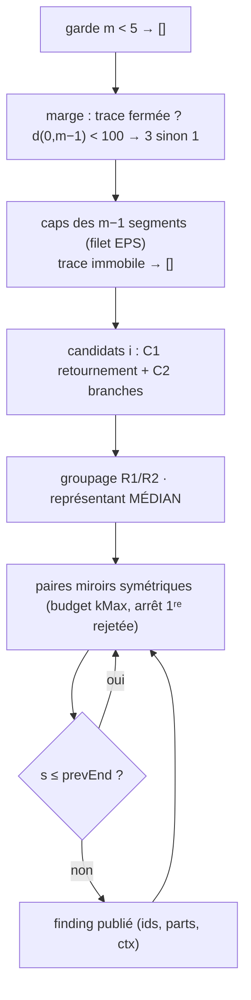
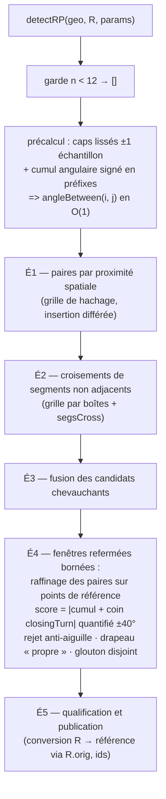

# Spécification algorithmique — Détection d'anomalies AR et RP

> **ANALYSE — V1.1**
> (avenant du 2026-09-11 : verdict `RP_erreur_Magny` corrigé — cf. §18)
> Spécification complète et autonome des deux algorithmes de détection
> d'anomalies de trace GPX :
> · **AR** — artefacts « aller-retour » ponctuels (zigzag, aiguille de
>   traceur, demi-tour avec re-parcours) ;
> · **RP** — boucles de giratoire (parcours de 270°, 360° ou plus causé
>   par un point de passage posé du mauvais côté d'un rond-point).
>
> Ce document est **autoportant** : il définit le modèle de données
> d'entrée, les prétraitements requis, la totalité des paramètres et
> constantes, les pseudocodes phase par phase, le contrat de sortie, les
> invariants, les cas limites et les scénarios de validation. Il est
> conçu pour permettre une **réimplémentation fidèle** des deux
> détecteurs dans toute application disposant d'une trace GPS
> échantillonnée, sans consulter aucun autre document.
>
> Documents associés : **IHM V1.0** (présentation, interactions,
> prévisualisations, échanges) ; **CORRECTIONS V1.0** (moteur de
> correction au niveau des données : réalignement, transformations,
> annulation, invariants).

---

## Table des matières

1. [Objet, périmètre, garanties générales](#1)
2. [Modèle de données d'entrée](#2)
3. [Paramètres et constantes](#3)
4. [Conventions d'indices et contrat de sortie](#4)
5. [Détecteur AR — algorithme complet](#5)
6. [Détecteur RP — vue d'ensemble du pipeline](#6)
7. [Détecteur RP — prétraitement : rééchantillonnage](#7)
8. [Détecteur RP — É1 : paires par proximité spatiale](#8)
9. [Détecteur RP — É2 : croisements de segments](#9)
10. [Détecteur RP — É3 : fusion des candidats](#10)
11. [Détecteur RP — É4 : fenêtres refermées bornées](#11)
12. [Détecteur RP — É5 : qualification et publication](#12)
13. [Calcul dérivé — ancres d'accès d'une boucle](#13)
14. [Invariants de sortie](#14)
15. [Cas limites et comportements attendus](#15)
16. [Justification des choix algorithmiques](#16)
17. [Scénarios de validation](#17)
18. [Avenant — correction du verdict `RP_erreur_Magny`](#18)

---

<a name="1"></a>
## 1. Objet, périmètre, garanties générales

### 1.1 Objet

Le module ANALYSE reçoit une trace GPS (liste ordonnée de points
géographiques) et produit une liste de **findings** : chaque finding
décrit une zone de la trace où le relevé présente un artefact
caractéristique :

| Famille | Artefact détecté | Signature géométrique |
|---|---|---|
| **AR** | Aller-retour ponctuel : demi-tour suivi (ou non) d'un re-parcours de la trace sur elle-même | Retournement de cap au sommet + paires de points quasi superposés symétriques autour du sommet |
| **RP** | Boucle de giratoire : parcours de ≥ 270° d'un anneau puis refermeture | Refermeture spatiale (trace repasse près d'elle-même ou ses segments se croisent) + rotation cumulée ≈ multiple de 360° (ou ≥ 270°) |

Les deux détecteurs sont **indépendants et complémentaires** : les
gardes du détecteur RP (anti-aiguille notamment) sont conçues pour
*ne pas* signaler ce que le détecteur AR couvre déjà, et réciproquement.
Un usage typique consiste à exécuter les deux et fusionner leurs
findings, triés par position croissante.

### 1.2 Périmètre

**Inclus** : prétraitements algorithmiques requis (rééchantillonnage RP),
détection, qualification, publication des findings, calcul dérivé des
ancres d'accès d'une boucle RP (§13).

**Exclus** (responsabilité de l'application hôte) : lecture des fichiers
GPX, consolidation de la trace (§2.3 — décrite car l'hôte doit la
reproduire pour satisfaire l'hypothèse d'amont), correction des
anomalies (cf. **CORRECTIONS V1.0**), rendu graphique et interactions
(cf. **IHM V1.0**), export.

### 1.3 Garanties générales

| Garantie | Description |
|---|---|
| Pureté | Les fonctions de détection ne lisent ni n'écrivent aucune structure externe à leurs arguments (pas de DOM, pas d'état global) |
| Déterminisme | Entrées identiques → sorties identiques (aucune composante aléatoire) |
| Non-mutation | Les structures d'entrée (`geo`, `R`, `params`) ne sont jamais modifiées |
| Retour total | Toujours un **tableau** de findings — `[]` si rien n'est détecté, jamais `null` |
| Unités | Mètres et degrés partout ; angles de cap en degrés [0, 360[ ; angles différentiels normalisés ]−180°, +180°] |
| Complexité | AR : O(m + P·kMax) temps, O(m) mémoire. RP : O(n) nominal par phase de candidats, borné par des compteurs de sécurité (§3.3) |

---

<a name="2"></a>
## 2. Modèle de données d'entrée

### 2.1 Point

Un point est le triplet minimal :

| Champ | Type | Unité / format | Nullabilité |
|---|---|---|---|
| `lat` | nombre | degrés décimaux WGS84 | obligatoire, finie |
| `lon` | nombre | degrés décimaux WGS84 | obligatoire, finie |
| `ele` | nombre | mètres | optionnel (ignoré par la détection) |

La trace d'entrée est une liste ordonnée `P₀ … P_{m−1}` de `m ≥ 2`
points. Les indices de la trace sont dits **indices de référence** :
ce sont eux que les findings publient (§4). Les discontinuités de
relevé (plusieurs `<trkseg>` dans un GPX) ne sont pas représentées :
les segments sont concaténés — le détecteur AR comporte une garde
spécifique pour les traces immobiles, et le détecteur RP ne cumule pas
de rotation fictive grâce à son lissage (§8.1).

### 2.2 Projection métrique locale

Toutes les mesures géométriques (distances, aires, produits vectoriels)
sont effectuées dans un repère plan local **équirectangulaire** centré
sur le premier point `P₀` de la trace :

```
kx = cos(lat₀ · π/180) · 111 320        // mètres par degré de longitude
ky = 110 540                            // mètres par degré de latitude

fwd(p)  :  x = (p.lon − lon₀) · kx   ;  y = (p.lat − lat₀) · ky
inv(x,y):  lat = lat₀ + y/ky         ;  lon = lon₀ + x/kx
```

`fwd`/`inv` sont cohérents (inv∘fwd = id). La distortion de cette
projection est négligeable pour des étendues de quelques dizaines de
kilomètres ; la compensation en distance par `kx = cos(lat₀)·111320`
rend les distances fiables, les angles restent corrects.

### 2.3 Consolidation (prétraitement requis par AR et RP)

**Règle glissante cumulative** : un point est supprimé si sa distance au
**dernier point conservé** est strictement inférieure au seuil σ. Le
premier point est toujours conservé. Invariant produit : deux points
consécutifs conservés sont distants d'au moins σ.

```
consolidate(trace, σ) :
    conservés = [P₀] ; référence = fwd(P₀)
    pour i = 1 .. m−1 :
        q = fwd(Pᵢ)
        si hypot(q − référence) < σ : supprimé (compteur++)
        sinon : conservés += Pᵢ ; référence = q
    retour conservés, supprimés
```

**Caractère cumulatif** — la comparaison se fait au dernier conservé,
pas au point précédent brut :

```
σ = 0,5 m
A → B : 0,10 m   B est à 0,10 m de A (dernier conservé)  → B supprimé
B → C : 0,25 m   C est à 0,25 m de B, MAIS on mesure C à A → < 0,5 m → C supprimé
C → D : 0,30 m   D est à 0,30 m de C, MAIS on mesure D à A → ≥ 0,5 m → D conservé
Résultat : A → D
```

σ = 0 désactive la consolidation (trace brute). **Hypothèse d'amont des
deux détecteurs** : la trace reçue est consolidée avec le σ courant —
les micro-segments (< σ) ne polluent ni les fenêtres de cap ni les
cumuls angulaires.

### 2.4 Structure `geo` (entrée des deux détecteurs)

Construite sur la trace consolidée :

```js
geo = {
  proj  : { fwd(p), inv(x, y) },   // §2.2
  px    : Float64Array(m),         // x métrique de chaque point
  py    : Float64Array(m),         // y métrique de chaque point
  cum   : Float64Array(m),         // distance cumulée depuis P₀ (m) ; cum[0] = 0
  total : number,                  // cum[m−1] — longueur totale (m)
  ids   : Array(m)                 // [intégration] identifiant stable de chaque point
}
```

`ids` n'est pas consommé par le cœur algorithmique ; il sert à
l'application hôte pour le contrat d'intégration (§4.4).

---

<a name="3"></a>
## 3. Paramètres et constantes

Ce chapitre est **normatif et exhaustif** : tout paramètre ou constante
susceptible d'influencer un détecteur y figure. Aucun autre réglage
n'existe.

### 3.1 Table master des paramètres

| Identifiant | Famille | Type / unité | Plage IHM (pas) | Défaut | Défaut si absent (`??`) | Phase(s) consommatrice(s) | Sémantique exacte |
|---|---|---|---|---|---|---|---|
| `p-consol` | commun | nombre, mètres | 0–5 (0,1) | 0,5 | 0,5 | **aucune** — façonne l'amont | Seuil de consolidation σ (§2.3) ; 0 = désactivé. Appliqué par l'hôte à l'import et avant chaque analyse. **N'est jamais transmis aux détecteurs** |
| `p-tol` | AR | nombre, degrés | 0–90 (1) | 20 | 20 | AR — candidats (C1) + groupage (R2) | Écart maximal au demi-tour parfait pour valider un retournement : `180 − diff ≤ p-tol` |
| `p-pair` | AR | nombre, mètres | 0–500 (5) | 50 | 50 | AR — paires miroirs + groupage (R2) | Distance maximale entre `P(i−k−1)` et `P(i+k+1)` pour accepter la paire d'ordre k ; aussi seuil de rapprochement de deux sommets groupables |
| `p-maxpairs` | AR | nombre entier | 1–10 (1) | 5 | 5 | AR — paires miroirs | Budget maximal de paires symétriques autour d'un sommet (extension amont/aval) |
| `p-seg` | AR | nombre, mètres | 10–1000 (10) | 200 | 200 | AR — candidats (C2) | Longueur maximale des deux branches du sommet — garde anti « vrai virage en épingle » |
| `p-close` | RP | nombre, mètres | 5–60 (1) | 15 | 15 | RP — É1 + É4 (anti-aiguille) + ancres (§13) | Seuil de refermeture : distance maximale entre deux points non consécutifs pour créer une paire candidate ; seuil du test miroir ; seuil de superposition au cœur (zone de l'ancre) |
| `p-angle` | RP | nombre, degrés | 270–360 (5) | 270 | 270 | RP — É4 (rejet final) | Angle cumulé minimal (après quantification) pour publier une fenêtre. 270 = « trois-quarts de tour et plus » ; 360 = « tours complets uniquement » |

**Effets d'augmentation / diminution** :

| Paramètre | Augmentation | Diminution |
|---|---|---|
| `p-consol` | trace plus lissée, moins de points ; micro-segments éliminés des fenêtres de cap | approche de la trace brute ; à 0, le filet de cap AR devient opérationnel (§5.2) |
| `p-tol` | accepte des retournements partiels (plus de candidats AR) | ne retient que les demi-tours quasi exacts ; à 0, sensible aux arrondis flottants (déconseillé en production) |
| `p-pair` | paires plus larges → emprises AR plus étendues | paires serrées uniquement ; à 0, seules les superpositions exactes |
| `p-maxpairs` | emprises AR étendues (plus de paires par sommet) | réduit l'emprise au voisinage immédiat du sommet |
| `p-seg` | tolère des branches longues | exclut les vraies épingles routières à grandes branches |
| `p-close` | + de candidats RP (giratoires larges, demi-tours) — **attention** : la garde miroir de l'anti-aiguille est calée dessus, un seuil trop grand réhabilite les aiguilles larges | + de sélectivité ; mini-giratoires plus détectables |
| `p-angle` | ne détecte que les tours complets (à 360 : tours complets et multiples) | détecte les trois-quarts de tour (270 : plancher — la plage inférieure a été retirée volontairement : pas de classe de sévérité sous 270°) |

**Interactions documentées** :

- `p-close` × `p-angle` : le critère géométrique est le filtre grossier,
  l'angulaire le filtre fin. Pour un giratoire de rayon r, la
  refermeture minimale observable vaut ≈ 2r entre voies opposées et ≈ r
  pour un trois-quarts ; `p-close ≈ r` couvre le cas nominal.
- `p-close` × pas d'échantillonnage RP : le pas (constante, §3.2) doit
  rester ≪ `p-close` ; sinon deux échantillons consécutifs peuvent
  sauter le couloir de refermeture (faux négatifs silencieux). C'est la
  raison pour laquelle le pas n'est **pas** exposé.
- `p-angle` × quantification : le seuil s'applique **après**
  quantification (§11.2) — un tour complet (320–400° bruts) vaut
  exactement 360° au moment du test ; un seuil > 360 rendrait le
  détecteur muet (plage morte).

### 3.2 Constantes internes

| Constante | Valeur | Unité | Famille | Phase | Rôle / calibrage | Conséquence d'une modification |
|---|---|---|---|---|---|---|
| `EPS` (caps AR) | 0,05 | m | AR | caps | Filet de sécurité des caps : segment plus court → cap reporté du voisin | Inactif si σ > 0,05 ; opérationnel si σ = 0 |
| Seuil « trace fermée » AR | 100 | m | AR | marge | `d(P₀, P_{m−1}) < 100` → marge 3 aux extrémités, sinon 1 | Réduit/élargit la zone explorable en début/fin de trace |
| `FUSE_GAP` | 6 | points | AR | groupage | Écart maximal de groupage de deux sommets (au-delà de 3 pts, fusion conditionnelle) | Deux artefacts AR distincts à ≤ 6 points fusionnent (compromis documenté §16) |
| `RP_STEP_DEFAULT` | 4 | m | RP | §7 | Pas d'échantillonnage. **Ne pas exposer** : couplage dur avec `p-close` (doit rester ≪ `p-close`) | Plus petit : précision ↑, coûts linéairement ↑ ; plus grand que `p-close/3` : faux négatifs |
| `RP_MAX_SAMPLES` | 120 000 | échantillons | RP | §7 | Plafond d'échantillons (garde-fou performance) ; garantit aussi `k < 10⁶` (clés de dédoublonnage) | ↑ mémoire linéairement |
| `RP_MIN_SAMPLES` | 12 | échantillons | RP | garde d'entrée | Trace dégénérée → `[]` | — |
| `RP_LMAX` | 800 | m | RP | É4 | Périmètre maximal d'un cœur de boucle (exclut les méga-paires d'aller-retours macroscopiques) | ↑ pour capturer des tours multiples très larges |
| `RP_MAX_GAP_M` | 4000 | m | RP | É1 | Portée maximale d'une boucle recherchée (plafond d'écart entre deux points appariés) | — |
| `MAX_PAIRS` | 40 000 | paires | RP | É1 | Borne de sécurité du nombre de paires brutes | Troncature propre sur traces pathologiques |
| `MAX_TESTS` | 1 500 000 | tests | RP | É2 | Borne de sécurité des tests de croisement | idem |
| `RP_MIN_SEP` | 6 | échantillons | RP | É1, É4a, É4b | Séparation minimale entre les deux points d'une paire (≈ 24 m de trace) — élimine les paires quasi contiguës | — |
| `RP_EPS_CROSS` | 1e-7 | m² | RP | É2 (`segsCross`) | Seuil du contact quasi exact (colinéarité) + expansion 1e-6 m de la boîte | Trop grand : faux « contacts » entre voies distinctes d'un giratoire |
| `RP_CIRC_MIN` | 0,10 | — | RP | É4 (anti-aiguille) | Circularité minimale du polygone fermé (cercle parfait = 1) | ↓ réhabilite des aiguilles à bruit large |
| `RP_MIRROR_MAX` | 0,95 | — | RP | É4 (anti-aiguille) | Fraction miroir maximale (fraction de points dont le symétrique est à < `p-close`) | ↑ réhabilite les aiguilles ; ↓ rejette des giratoires très étroits |
| `RP_COIN_LO` / `RP_COIN_HI` | 130 / 240 | ° | RP | É4 (`closingTurn`) | Amplitude d'éligibilité du coin de refermeture (demi-tours de réengagement uniquement) | Élargir : risque de contamination des fenêtres non refermées |
| `RP_PROPRE_DEG` | 60 | ° | RP | É4 (`closingDelta`) | Écart minimal des caps pour déclarer une fenêtre « propre » | — |
| `RP_QUANT_TOL` | 40 | ° | RP | É4 (quantification) | Tolérance d'alignement sur un multiple de 360° | Fidèle à la physique (refermeture à l'angle vif : 320–400° bruts) |
| `RP_PAIRS_TOP` | 6 | paires | RP | É5 | Nombre maximal de paires restituées par finding (les plus serrées) | — |
| `RP_ZONE_M` | 80 | m | RP | É5 | Largeur cible des portions approche/sortie publiées autour du cœur | — |
| `RP_ANCHOR_DELTA_ABS` | 12 | m | ancres | §13 | δ absolu du disque élargi (bruit GPS + demi-chaussée — ne croît pas avec r) | — |
| `RP_ANCHOR_DELTA_K` | 0,4 | — | ancres | §13 | δ relatif (imperfection de forme — croît avec r) | — |
| `RP_ANCHOR_EXT_M` | 15 | m | ancres | §13 | Marge d'extension après le plancher (l'ancre marque la frontière de la zone, pas le milieu de la route) | — |
| `RP_ANCHOR_SEARCH_BASE` | 150 | m | ancres | §13 | Portée minimale de recherche hors zone ; portée effective = max(150, 2,5·r) | — |
| `RP_ANCHOR_HARD_M` | 2000 | m | ancres | §13 | Plafond global dur de la marche (sécurité) | — |
| `RP_ANCHOR_PERSIST` | 2 | points | ancres | §13 | Points consécutifs hors zone confirmant la sortie | — |
| `RP_ANCHOR_MAX_SAMPLES` | 200 | points | ancres | §13 | Échantillonnage maximal du cœur (Kåsa + tests de superposition) | — |
| Seuils internes ancres | 1e-6 (déterminant) · [3, 1000] m (rayon plausible) · 0,05 m (micro-segment sauté) · 8 m / 4 segments (portée de cap) | — | ancres | §13 | Stabilité numérique de Kåsa ; plausibilité du cercle ajusté ; marche de cap | — |

### 3.3 Contrat de passage des paramètres

Les paramètres arrivent aux détecteurs sous forme d'un objet plat
`params = { '<identifiant>': valeurNumérique }` produit par l'hôte (en
IHM : lecture de tous les réglages). Chaque détecteur applique ses
défauts par clé absente — table exacte des replis :

```js
// AR
tolDeg  = params['p-tol']      ?? 20
pairMax = params['p-pair']     ?? 50
kMax    = params['p-maxpairs'] ?? 5
brMax   = params['p-seg']      ?? 200
// RP
closeThr = params['p-close'] ?? 15
angThr   = params['p-angle'] ?? 270
```

`p-consol` n'apparaît dans aucun des deux objets consommés : il est
consommé **en amont** par `consolidatePoints` (§2.3), par l'hôte, à
l'import et avant chaque analyse.

---

<a name="4"></a>
## 4. Conventions d'indices et contrat de sortie

### 4.1 Conventions d'indices

| Espace | Description |
|---|---|
| **Indice de référence** | Position dans la trace consolidée reçue (`geo.px/py`, 0-based). **Tous les champs de sortie des findings sont exprimés dans cet espace.** Convention d'affichage utilisateur : indice + 1 (base 1) |
| Indice R (RP interne) | Position dans la trace rééchantillonnée (§7), 0..n. **Strictement interne à `detectRP`** ; toute grandeur publiée est convertie via `R.orig` (§12) |

### 4.2 Structure de sortie — finding

```js
{
  kind       : 'ar' | 'rp',
  label      : string,          // SANS numéro — « Aller-retour » (AR),
                                // « Boucle giratoire » / « Tour de rond-point » (RP) ;
                                // l'hôte numérote par famille à la fusion
  summary    : string,          // régénérable depuis les mesures invariantes
  peak       : int,             // indice de référence — AR : sommet ;
                                // RP : jonction = 1er point du cœur
  pairs      : [ { aid, bid, a, b, d }, ... ],
              // a/b : indices de référence amont/aval (base 0)
              // aid/bid : identifiants stables correspondants [intégration]
              // d : distance réelle mesurée (m) — TOUJOURS défini
              // ordre k croissant (AR) / tri par d croissant (RP)
  pairIdx    : [a₁, b₁, a₂, b₂, ...],   // aplatissement des index
  ecart      : number,          // AR uniquement : 180 − diff (°)
  d1, d2     : number,          // AR uniquement : branches amont/aval (m)
  totalAngle : int,             // RP uniquement : angle cumulé arrondi (post-quantification)
  turnText   : string,          // RP uniquement : libellé humain de la rotation
  zoneIds    : [ id, ... ],     // ids de l'EMPRISE dans l'ordre de trace
  coreIds    : [ id, ... ],     // RP uniquement : ids du CŒUR (la boucle)
  ctxIds     : { up: id|null, dn: id|null },  // points sains adjacents
  status     : 'pending',       // état initial
  correction : null,
  undo       : null,
  ctx        : { up: int|null, dn: int|null }, // indices de référence des points sains
  parts      : [ { s, e, role, text }, ... ]  // sous-zones (§4.3)
}
```

`aid`/`bid`/`zoneIds`/`coreIds` supposent que l'hôte attribue un
identifiant stable à chaque point de la trace (compteur séquentiel au
chargement, jamais recyclé). Un hôte sans ids peut les remplacer par les
indices de référence eux-mêmes **à condition** de ne jamais éditer la
trace sans re-publier les findings (l'application de référence, elle,
réaligne les index par traduction d'ids après chaque édition —
`syncIndexes`, cf. CORRECTIONS V1.0 §3).

### 4.3 Sous-zones (`parts`)

| Famille | parts[0] | parts[1] |
|---|---|---|
| AR | `{ s, e, role:'warn', text }` — l'EMPRISE complète `[i−k−1, i+k+1]` ; texte : liste des paires miroirs ou « retournement isolé, aucune paire miroir » | `{ i−1, i+1, role:'info', text }` — le CŒUR (sommet ±1) ; texte : « cœur : demi-tour · branches d1/d2 m » |
| RP | `{ sRef, eRef, role:'warn', text }` — l'EMPRISE (approche + cœur + sortie) ; texte : « superpositions : … » ou « refermeture par croisement de trace » | `{ csRef, ceRef, role:'warn', text }` — le CŒUR (la boucle) ; texte : « cœur : angle cumulé N° (turnText) » |

**Rôle des points de contexte** (`ctx`, `ctxIds`) : ils ne participent
pas à la détection ; ils servent au rendu (marqueurs « sains ») et à
l'application hôte (ancres par défaut des corrections, points non
supprimables). `null` si l'anomalie touche une extrémité de trace.

### 4.4 Conventions de texte (reproductibilité des `summary`/`text`)

- Numéros affichés = indice de référence + 1 ;
- distances : 1 décimale si < 10 m, arrondi à l'unité sinon ; séparateur
  « · » ; flèche de paire « ↔ » ; écart angulaire arrondi à l'unité ;
- l'hôte peut régénérer `summary` et `parts[].text` après édition de la
  trace à partir des mesures invariantes (`pairs`, `ecart`, `totalAngle`,
  `turnText`) et des index courants — les gabarits exacts sont
  spécifiés en CORRECTIONS V1.0 §2.4.

---

<a name="5"></a>
## 5. Détecteur AR — algorithme complet

`detectAR(geo, params)` → findings[].

### 5.1 Vue d'ensemble



### 5.2 Phase 1 — caps des segments

Le cap du segment `j` (reliant `Pⱼ` à `Pⱼ₊₁`) est l'azimut en degrés
[0, 360[ :

```
pour j = 0 .. m−2 :
    dx = px[j+1] − px[j] ;  dy = py[j+1] − py[j]
    si hypot(dx, dy) ≥ EPS :
        head[j] = (atan2(dx, dy) · 180/π + 360) % 360     // azimut depuis le nord
        prevHead = head[j]
    sinon :
        head[j] = prevHead                                // report avant (filet EPS)
pour j = m−2 .. 0 (arrière) :                            // report arrière des têtes
    si head[j] est défini : nxt = head[j] sinon head[j] = nxt
si head[0] est indéfini : retour []                      // trace immobile
```

`atan2(dx, dy)` (est, nord) fournit l'azimut horaire depuis le nord.
Le filet EPS reporte le cap des micro-segments (inactif si σ > EPS,
opérationnel si σ = 0).

### 5.3 Phase 2 — candidats sommets

Pour `i` dans `[margin, m−1−margin]` (marge = 3 si trace fermée, 1 sinon) :

```
C1 (retournement)  :  diff = |head[i] − head[i−1]| réduite à [0, 180]
                      (diff > 180 → 360 − diff) ;  retenir si 180 − diff ≤ p-tol
C2 (branches)      :  d1 = |P(i) − P(i−1)| ;  d2 = |P(i+1) − P(i)|
                      retenir si d1 ≤ p-seg ET d2 ≤ p-seg
candidat = { i, diff, d1, d2 }
```

### 5.4 Phase 3 — groupage des sommets

Les candidats sont triés par `i` croissant puis groupés par chaînage :

```
R1 (voisins)      :  écart au dernier membre du groupe < 3 points
                     → fusion INCONDITIONNELLE
R2 (bosse/zigzag/  :  écart ≤ FUSE_GAP (6) ET l'une des conditions :
    stationnaire)      · caps « jumeaux »    : |head[g[0].i − 1] − head[c.i]| ≤ p-tol
                       · caps « opposés »    : |180 − même écart| ≤ p-tol
                       · sommets proches     : dist(P[c.i], P[dernier membre]) ≤ p-pair
```

(où `head[g[0].i − 1]` est le cap du segment **précédant le premier
candidat** du groupe — le « cap entrant » du groupe — réduit à [0, 180]
comme en C1.)

**Représentant du groupe** : le candidat **médian** — minimisant
`|c.i − milieu|` avec `milieu = (premier.i + dernier.i)/2` ; à égalité,
le candidat au retournement le plus net (`diff` maximal) ; à nouvelle
égalité, le premier. Un groupe ne produit qu'un seul sommet testé.

### 5.5 Phase 4 — paires miroirs et emprise

Pour chaque sommet retenu `i`, dans l'ordre croissant :

```
pairs = []
pour k = 1 .. p-maxpairs :
    a = i − k − 1 ;  b = i + k + 1                    // symétrie stricte par index
    si a < 0 ou b > m−1 ou a ≤ prevEnd : sortir
    d = |P(b) − P(a)|
    si d > p-pair : sortir                            // arrêt à la PREMIÈRE rejetée
    pairs += { a, b, d }
k = |pairs| ;  s = i − k − 1 ;  e = i + k + 1
si s ≤ prevEnd : ignorer (emprise incluse dans la précédente)
```

`prevEnd` est la fin d'emprise du finding précédemment publié — garantit
des emprises AR **disjointes et ordonnées**.

### 5.6 Publication

```js
{
  kind: 'ar', label: 'Aller-retour',
  summary: `sommet pt ${i+1} · ${k} paire(s) · écart ${round(180 − diff)}°`,
  peak: i, peakId: ids[i],
  pairs: [{ aid: ids[a], bid: ids[b], a, b, d }],   // k croissant
  pairIdx: [a₁, b₁, ...],
  ecart: 180 − diff, d1, d2,
  zoneIds: ids[s..e],
  ctxIds: { up: ids[s−1] si s ≥ 1 sinon null, dn: ids[e+1] si e ≤ m−2 sinon null },
  ctx:    { up: s−1 ou null, dn: e+1 ou null },
  status: 'pending', correction: null, undo: null,
  parts: [ { s, e, 'warn', k ? `paires miroirs : pts a↔b (d m) · …`
                             : 'retournement isolé, aucune paire miroir' },
           { i−1, i+1, 'info', `cœur : demi-tour · branches ${d1}/${d2} m` } ]
}
prevEnd ← e
```

---

<a name="6"></a>
## 6. Détecteur RP — vue d'ensemble du pipeline



Principe hybride : le critère **géométrique** (É1 + É2) produit des
*candidates* — des intervalles où la trajectoire « se referme » ; le
critère **angulaire** (É4) valide ou rejette chaque candidate ; les
gardes **structurelles** (fenêtres bornées, anti-aiguille, propreté)
excluent les motifs dégénérés.

---

<a name="7"></a>
## 7. Détecteur RP — prétraitement : rééchantillonnage

`resampleGeo(geo, step = RP_STEP_DEFAULT)` → `R`.

**Objectif** : rendre les seuils métriques (fermeture, portées, portions)
indépendants de la densité du GPX — un fichier à 1 point/10 m et un
fichier à 10 points/1 m produisent la même structure `R`.

```
n   = max(1, round(geo.total / step))
si n > RP_MAX_SAMPLES : n = RP_MAX_SAMPLES      // garde-fou performance
eff = geo.total / n                             // pas effectif (≈ step)
pour i = 0 .. n :
    d = min(i · eff, geo.total)                 // distance cible depuis le départ
    avancer k tant que k < m−2 et geo.cum[k+1] < d     // segment hôte de la cible
    segLen = geo.cum[k+1] − geo.cum[k]
    t = segLen > 0 ? (d − geo.cum[k]) / segLen : 0     // paramètre [0..1]
    RX[i] = geo.px[k] + t·(geo.px[k+1] − geo.px[k])
    RY[i] = geo.py[k] + t·(geo.py[k+1] − geo.py[k])
    cumR[i] = cumR[i−1] + hypot(RX[i]−RX[i−1], RY[i]−RY[i−1])   // cumR[0] = 0
    orig[i] = (i == n) ? m−1 : k                // R i → INDICE DE RÉFÉRENCE
retour { n, RX, RY, cumR, orig, step: eff }
```

**Sortie `R`** :

| Champ | Contenu |
|---|---|
| `n` | nombre d'intervalles (échantillons valides 0..n, soit n+1) |
| `RX`, `RY` | coordonnées métriques des échantillons |
| `cumR` | distance cumulée le long des échantillons (m) |
| `orig` | `Uint32Array(n+1)` — **pivot du contrat** : indice de référence hébergeant chaque échantillon (monotone croissant) |
| `step` | pas effectif (m) |

---

<a name="8"></a>
## 8. Détecteur RP — É1 : paires par proximité spatiale

### 8.1 Précalcul des caps et du cumul angulaire

Le cap au point k est mesuré sur la **fenêtre centrale** `P(k−1) → P(k+1)`
(lissage qui écrête le bruit GPS : ≈ 15°/échantillon sur un giratoire de
rayon 15 m à 4 m de pas, très au-dessus du bruit) :

```
pour k = 1 .. n−1 :
    dx = RX[k+1] − RX[k−1] ;  dy = RY[k+1] − RY[k−1]
    heads[k] = hypot(dx, dy) > 1e-9 ? atan2(dy, dx) · 180/π : NaN
pre[0] = pre[1] = 0
pour k = 2 .. n−1 :
    d = heads[k] − heads[k−1]
    si heads non définies : d = 0
    sinon : normaliser d dans ]−180, +180]         // 350° → 10° compte +20°, pas −340°
    pre[k] = pre[k−1] + d
pre[n] = pre[n−1] ?? 0
angleBetween(i, j) = pre[j] − pre[i]               // rotation SIGNÉE cumulée, O(1)
```

La **signature** du cumul porte le sens de rotation : un tour complet
anti-horaire vaut +360°, un enchaînement de virages en S se compense —
c'est cette propriété qui distingue une boucle d'un zigzag de même
enveloppe. (Le repère angulaire exact — azimut ou angle géométrique —
est indifférent : seules les **différences** de caps sont consommées.
Les deux détecteurs de cette spécification utilisent des conventions
d'appel différentes d'`atan2` — azimut en AR, angle géométrique en RP —
sans conséquence sur leurs résultats respectifs.)

**Limite connue et assumée** : au point de refermeture, quand le
véhicule se réengage sur la branche d'entrée, la fenêtre ±1 **moyenne
deux directions qui se font face** — le demi-tour de réengagement
s'annule du cumul (une boucle complète peut mesurer ~175° au lieu de
~340°). Ce cas est traité par le coin de refermeture `closingTurn`
(§11.3), pas par un changement du lissage.

### 8.2 Recherche des paires

Une boucle candidate est un couple `(j, i)`, `j < i`, tel que :

```
distance(P(j), P(i)) < closeThr        avec   i − j > RP_MIN_SEP (6)
                                       et     i − j ≤ maxGap
maxGap = min(n, ceil(RP_MAX_GAP_M / step) + 8)     // ≈ 4 km de portée
```

La contrainte de séparation élimine les paires quasi contiguës ; le
plafond d'écart borne la longueur de boucle recherchée.

**Grille de hachage spatiale, insertion différée** (un test naïf
double-boucle coûte O(n²)) :

```
cell = max(closeThr, 1)                 // cellule × cellule mètres
grid : Map< "cx|cy", liste d'indices R >
pour i = 0 .. n :
    cx = floor(RX[i]/cell) ;  cy = floor(RY[i]/cell)
    pour gx = −1..1, gy = −1..1 :                       // 9 cellules voisines
        pour chaque j dans grid["(cx+gx)|(cy+gy)"] :
            si i − j < RP_MIN_SEP ou i − j > maxGap : continuer
            si hypot(RX[i]−RX[j], RY[i]−RY[j]) < closeThr :
                cands += { s: j, e: i, paire: [j, i] }
                si |cands| ≥ MAX_PAIRS : sortir de tout
    insérer i dans grid["cx|cy"]                        // APRÈS la comparaison
```

L'insertion différée garantit que chaque paire `(j, i)` n'est examinée
qu'une fois (j avant i). Coût nominal **O(n)** ; les paires brutes ne
portent **pas** la distance (mesurée au raffinage, §11.1 — invariant « d
toujours défini »).

---

<a name="9"></a>
## 9. Détecteur RP — É2 : croisements de segments

Rôle : capter les boucles refermées **sans doublon de points** — trace
retombant exactement entre deux échantillons, ou extrémités de boucle
espacées de plus de `closeThr` mais segments se coupant franchement.

Chaque segment `k = [P(k), P(k+1)]` (k = 0..n−1) est comparé aux
segments **antérieurs non adjacents** `m` (`k − m ≥ 3`). Chaque
croisement produit le candidat `{ s: m, e: k+1, croisement: [m, k+1] }`.

### 9.1 `segsCross(R, a, b)` — test géométrique

Niveau 1 — **croisement strict** par produits vectoriels (orientation) :

```
A = P(a), B = P(a+1), C = P(b), D = P(b+1)
o1 = (B−A) × (C−A)      o2 = (B−A) × (D−A)
o3 = (D−C) × (A−C)      o4 = (D−C) × (B−C)        // u × v = ux·vy − uy·vx
croisement strict  ⟺  (o1·o2 < 0) ET (o3·o4 < 0)
```

Niveau 2 — **contact quasi exact** (colinéarité) — attrape les boucles
« posées à plat » l'une sur l'autre sans croisement franc :

```
EPS = 1e-7 (m², sur le produit vectoriel) ;  expansion de boîte = 1e-6 m
Q « sur » [U,V]  ⟺  |(V−U) × (Q−U)| ≤ EPS  ET  Q dans la boîte de [U,V] élargie
contact  ⟺  C sur AB ∨ D sur AB ∨ A sur CD ∨ B sur CD
```

Le seuil très strict (superposition au centimètre) évite les faux
« contacts » entre voies distinctes d'un giratoire.

### 9.2 Indexation

Même technique de grille, mais les cellules contiennent des **segments**
et la taille de cellule est `cell2 = max(closeThr, 3·step)` : le
segment est indexé dans **toutes** les cellules de sa boîte englobante
(1 à 2 cellules par axe en nominal), explorée explicitement à la
recherche. Dédoublonnage des couples par la clé `m·10⁶ + k` (sûre : le
garde-fou garantit `k < 120 000 < 10⁶`). Compteur global borné à
`MAX_TESTS = 1 500 000` tests de croisement.

---

<a name="10"></a>
## 10. Détecteur RP — É3 : fusion des candidats

Un même giratoire génère des **dizaines** de candidats qui se
recouvrent ; il faut les réduire à des intervalles uniques.

```
trier cands par (s croissant, e croissant)
merged = []
pour chaque c de cands :
    last = dernier élément de merged
    si last existe et c.s ≤ last.e :                     // recouvrement
        last.e = max(last.e, c.e)                        // extension englobante
        c.paire      → last.paires                       // paires BRUTES
        c.croisement → last.croisements
    sinon :
        merged += { s: c.s, e: c.e, paires: [...], croisements: [...] }
```

Propriété : les groupes produits sont **disjoints et ordonnés** —
condition requise par l'É5 pour borner mutuellement les emprises
d'anomalies consécutives.

**Attention (leçon de cas réel)** : sur une trace en aller-retour
macroscopique, un même groupe peut fusionner des **centaines** de
candidats hétérogènes en un méga-intervalle quasi égal à la trace
entière. L'intervalle fusionné n'est qu'un **conteneur de candidats**,
jamais une anomalie en soi — c'est l'É4 (fenêtres bornées) qui démêle.

---

<a name="11"></a>
## 11. Détecteur RP — É4 : fenêtres refermées bornées

Cœur analytique du module. Chaque refermeture candidate — paire
raffinée **ou** croisement — est évaluée comme une **fenêtre `[a, b]`**
indépendante ; puis une sélection gloutonne retient les meilleures
fenêtres disjointes.

### 11.1 Raffinage des paires sur les points de référence

Les paires de l'É1 sont en indices d'**échantillons** — leur position
dépend de la phase du pas d'échantillonnage. Or la refermeture réelle se
produit entre points **de référence** (parfois en superposition exacte,
distance 0,0 m). Pour chaque paire brute :

```
best = null
pour da = −2..2, db = −2..2 :                       // 25 combinaisons
    ia = a + da ;  ib = b + db
    si ia ≥ 0 et ib ≤ n et ib − ia ≥ RP_MIN_SEP :
        d = hypot(refX[orig[ia]] − refX[orig[ib]], refY[orig[ia]] − refY[orig[ib]])
        si d < best.d : best = { a: ia, b: ib, d }
déduplication par clé best.a·10⁶ + best.b
dMin = min des distances raffinées (0 si aucune)
```

**Effets** : la distance publiée est celle de la trace de référence
(0,0 m sur re-parcours exact) ; les numéros correspondent à la
nomenclature courante ; **`d` est garanti défini** — seule cette liste
peut être restituée.

### 11.2 Fenêtres depuis les paires / les croisements

```
pushWindow(a, b, d, withCoin) :
    si b − a < RP_MIN_SEP                  : rejet      // trop court
    si cumR[b] − cumR[a] > RP_LMAX (800 m) : rejet      // fenêtre BORNÉE
    ang = angleBetween(a, b)                             // rotation signée cumulée
    coin = 0
    si withCoin ET d ≠ null ET d ≤ dMin + max(2, 0,25·closeThr) :   // paire SERRÉE seulement
        t = closingTurn(R, b)                            // §11.3
        si t ≠ null et 130 ≤ |t| ≤ 240 :                 // vrais demi-tours de réengagement
            si |ang| > 30 et signe(t) ≠ signe(ang) :
                t −= 360 · signe(t)                      // alignement du sens
            coin = t
    total = |ang + coin|
    k = round(total / 360)                               // QUANTIFICATION
    si k ≥ 1 et |total − 360·k| ≤ RP_QUANT_TOL (40°) :  total = 360·k
    si total < p-angle                      : rejet      // validation angulaire
    si loopDegenerate(R, a, b, closeThr)    : rejet      // §11.4 — anti-aiguille
    dc = withCoin ? closingDelta(R, a, b) : null         // §11.5
    fenêtre = { a, b, d, total,
                propre: withCoin ? (dc == null ou |dc| ≥ 60°) : true,
                pairsIn: [] }
```

Paires → `pushWindow(p.a, p.b, p.d, withCoin = true)` ;
croisements `[ca, cb]` → `pushWindow(ca, cb, d = null, withCoin = false)`
(mêmes filtres de longueur, score **sans coin**, `propre = true`).

**Motifs corrigés d'origine de chaque garde** (cas de test §17) :

| Garde | Motif |
|---|---|
| coin `closingTurn` | le lissage ±1 échantillon annule le demi-tour de réengagement (~175° mesurés pour ~340° réels) |
| éligibilité du coin 130–240°, paires serrées uniquement | zéro régression : les virages de reprise < 130° sont déjà bien mesurés par le lissage |
| fenêtres bornées (LMAX) | une méga-paire de ~2 km englobait 8 tours du vrai giratoire : l'intervalle fusionné est un conteneur, pas une anomalie |
| anti-aiguille | deux demi-tours de même sens = ±360° de cap, indiscernable du tour par le cap seul |

### 11.3 `closingTurn(R, rb)` — le coin de refermeture

Mesuré sur les échantillons **bruts** (hors lissage) : cap entrant
(j → jonction rb) vs cap sortant (jonction rb → k), où j et k sont
obtenus par `rpWalk` :

```
rpWalk(R, from, dir, minM = 8, maxSeg = 4) :
    i = from ;  acc = 0 ;  segs = 0
    tant que segs < maxSeg :
        ni = i + dir ;  si ni < 0 ou ni > R.n : sortir
        d = hypot(R[ni] − R[i]) ;  i = ni
        si d < 0,05 m : continuer                       // micro-segment sauté (hors budget)
        segs++ ;  acc += d
        si acc ≥ minM : retour i
    retour acc > 0 ? i : null

closingTurn(R, rb) :
    ja = rpWalk(R, rb, −1) ;  ka = rpWalk(R, rb, +1)
    si ja ou ka est null : retour null
    capEntrant = atan2(RY[rb]−RY[ja], RX[rb]−RX[ja])
    capSortant = atan2(RY[ka]−RY[rb], RX[ka]−RX[rb])
    retour normalisé à (−180°, +180°] de (capSortant − capEntrant)
```

### 11.4 `loopDegenerate(R, a, b, closeThr)` — garde anti-aiguille

**Principe géométrique** : un anneau *balise une surface*, une aiguille
non. Deux tests indépendants ; **rejet si l'un OU l'autre déclenche**.

**Test 1 — circularité du polygone fermé `[a..b]`** (formule du lacet,
corde de fermeture b→a incluse) :

```
A2 = Σ (xᵢ·yᵢ₊₁ − xᵢ₊₁·yᵢ) pour i de a à b−1   +   (x_b·y_a − x_a·y_b)
L  = Σ |P(i+1) − P(i)| pour i de a à b−1        +   |P(b) − P(a)|
circularité = 4π · |A2/2| / L²
rejet si circularité < 0,10
```

Un anneau : 0,2–1,0 (cercle parfait = 1). Un aller-retour : ≈ 0 — les
aires algébriques de l'aller et du retour se compensent, même avec du
bruit GPS.

**Test 2 — recouvrement miroir** :

```
pour chaque échantillon i de [a..b] :
    miroir = b − (i − a)          // symétrique par longueur depuis l'extrémité
    si dist(i, miroir) < closeThr : near++
rejet si near / total ≥ 0,95
```

Dans un aller-retour, chaque point a son miroir sur le brin retour à
moins du seuil (fraction ≈ 1). Sur un anneau, les miroirs s'écartent en
`2r·sin(θ/2)` dès qu'on quitte la jonction (fraction typique 0,3–0,9).

**Compromis documenté** : un giratoire dont le **diamètre est inférieur
au seuil de fermeture** est géométriquement indiscernable d'un
aller-retour à cette résolution ; le levier est la réduction de
`p-close`.

### 11.5 `closingDelta(R, ra, rb)` — drapeau « fenêtre propre »

Mesure l'écart entre le cap sortant au point b (~8 m vers l'aval, par
`rpWalk`) et le cap entrant au point a (~8 m vers l'amont), normalisé à
(−180°, +180°] :

```
propre  ⟺  dc == null (indéterminable)  OU  |dc| ≥ 60°
```

Une fenêtre **propre** repart dans une direction **différente** de son
cap d'entrée — le virage d'insertion/sortie les sépare. Une fenêtre qui
repart dans son cap d'entrée a englobé un aller-retour du tronçon
commun (motif : fenêtre débordant sur la voie de sortie, ~450° mesurés).

### 11.6 pairsIn et sélection gloutonne (É4d/É4e)

```
É4d — pour chaque fenêtre w : paires raffinées q telles que
      w.a ≤ q.a et q.b ≤ w.b (contenues) — tri (a, b) des paires,
      balayage avec coupure q.a > w.b.

É4e — tri des fenêtres :
      1. propres d'abord        (refermeture ≠ cap d'entrée)
      2. total décroissant      (rotation la plus forte)
      3. d croissant (null = ∞) (refermeture la plus serrée)
      4. span croissant         (fenêtre la plus compacte)
      glouton : retenir une fenêtre si elle ne chevauche AUCUNE déjà prise
      re-tri des retenues par a croissant
```

La préférence « propres d'abord » écarte les fenêtres débordantes (même
à score supérieur) ; « distance puis span croissants » absorbe les tours
déphasés (plusieurs fenêtres décrivant le même tour) en une seule
retenue.

---

<a name="12"></a>
## 12. Détecteur RP — É5 : qualification et publication

Les fenêtres retenues sont qualifiées une à une et publiées en indices
de **référence**. `W = max(2, round(RP_ZONE_M / step))` : largeur des
portions latérales (~80 m de trace, en échantillons).

### 12.1 Bornage et conversion d'indices

Les fenêtres vivent en espace **échantillons** ; toute grandeur publiée
est convertie via `R.orig` (monotone) — **sinon les indexations de
`ids`/`px`/`py` sortent du tableau** (défaut historique : « Invalid
LatLng (NaN, NaN) »).

```
prevERef = −1                                    // fin d'emprise précédente (référence)
pour chaque fenêtre w (ordre a croissant), index wi :
    csRef = orig[w.a] ;  ceRef = orig[w.b]       // cœur (entrée / sortie de boucle)
    si ceRef ≤ prevERef : fenêtre absorbée — ignorée
    nextCsRef = orig[fenêtre_suivante.a]  ou  m  (dernière)
    sRef = max(0, prevERef + 1, orig[max(0, w.a − W)])   ;  si sRef > csRef : sRef = csRef
    eRef = min(m−1, nextCsRef − 1, orig[min(n, w.b + W)]) ;  si eRef < ceRef : eRef = ceRef
    // Élargissement D2 aux ancres radiales (§13) — l'emprise englobe
    // toujours la zone de routage par défaut :
    an0 = rpAnchorIndices(geo, csRef, ceRef, closeThr)
    si an0.up ≠ null et an0.up < sRef : sRef = max(prevERef + 1, an0.up)
    si an0.dn ≠ null et an0.dn > eRef : eRef = min(nextCsRef − 1, an0.dn)
    re-clamps : sRef ≤ csRef ;  eRef ≥ ceRef
    prevERef ← eRef                              // emprises voisines : jamais de chevauchement
```

### 12.2 Publication

```
juncRef = csRef                                  // jonction = DÉBUT de boucle
pairs = top RP_PAIRS_TOP de pairsIn triées par d croissant
        → { aid: ids[orig[p.a]], bid: ids[orig[p.b]], a: orig[p.a], b: orig[p.b], d: p.d }
label   = total > 340 ? 'Tour de rond-point' : 'Boucle giratoire'   // SANS numéro
summary = `jonction pt ${csRef+1} · ${round(w.total)}° (${turnText(w.total)}) · ${k} paire(s)`
totalAngle = round(w.total) ;  turnText = turnText(w.total)
peak = csRef ;  peakId = ids[csRef]
zoneIds = ids[sRef..eRef]                        // approche + cœur + sortie
coreIds = ids[csRef..ceRef]                      // la boucle (bornes par défaut du routage)
ctxIds  = { up: ids[sRef−1] si sRef ≥ 1 sinon null, dn: ids[eRef+1] si eRef ≤ m−2 sinon null }
status = 'pending' ;  correction = null ;  undo = null
parts[0] = { sRef, eRef, 'warn', k ? `superpositions : pts a↔b (d m) · …`
                                 : 'refermeture par croisement de trace' }
parts[1] = { csRef, ceRef, 'warn', `cœur : angle cumulé ${round(w.total)}° (${turnText})` }
```

**`turnText(total)`** — traduction humaine de la rotation :

```
k = round(total / 360)
si k ≥ 1 et |total − 360k| ≤ 30 :
    k = 1 → "tour complet (1×)" ;  k > 1 → "k tours complets"
sinon si total < 240 : "demi-tour dépassé"
sinon :
    base = floor(total / 360) ;  q = round((total − 360·base) / 90)
    quart ∈ { '', '1/4 de tour', '1/2 tour', '3/4 de tour', 'tour complet' }
    base = 0 → quart (ou "N°" brut) ;  q = 0 → "base tours complets"
    sinon → "base tour(s) complet(s) + quart"
```

**Choix de la jonction** : le début de boucle (et non le milieu de la
paire de refermeture) — le milieu tomberait au centre du giratoire quand
les voies entrée/sortie sont superposées.

---

<a name="13"></a>
## 13. Calcul dérivé — ancres d'accès d'une boucle

`rpAnchorIndices(geo, junc, ce, closeThr)` — détermine les points
d'**entrée** (amont) et de **sortie** (aval) d'une boucle publiée, sur
les routes droites qui l'encadrent. Calcul **dérivé** : consommé par
l'application hôte (bornes par défaut du routage, élargissement D2 des
emprises) ; **lazy** — recalculé sur la trace courante à chaque usage,
jamais stocké dans le finding (il suit les éditions sans état).

### 13.1 Principe géométrique

Les points de l'anneau sont quasi **équidistants du centre** (plateau
radial) ; les routes d'approche/sortie s'en écartent en `√(r² + s²)` où
`s` est la distance parcourue sur la route. Ce signal est **indépendant
de la densité d'échantillonnage** et **invariant au diamètre** (§3.2 :
δ hybride absolu/relatif, portées fonctions de r).

### 13.2 Algorithme

```
ÉCHANTILLONS DU CŒUR
    stride = max(1, ceil((ce − junc + 1) / 200))
    P = échantillons { x: px[i], y: py[i] } pour i = junc..ce pas stride

1. CENTRE — ajustement de cercle de KÅSA (moindres carrés)
    centroïde (cx₀, cy₀) de P ; coordonnées centrées u = x − cx₀, v = y − cy₀
    cumuls : Suu, Suv, Svv, Su, Sv, nn, Suz, Svz, Sz (z = u² + v²)
    det = Suu·(Svv·nn − Sv²) − Suv·(Suv·nn − Su·Sv) + Su·(Suv·Sv − Svv·Su)
    si |det| > 1e-6 :
        résoudre (a, b, c) par Cramer (remplacements de colonnes dans la
        matrice [[Suu, Suv, Su],[Suv, Svv, Sv],[Su, Sv, nn]] × (a,b,c) = (Suz, Svz, Sz))
        rFit = √(max(0, c + a²/4 + b²/4))
        si rFit ∈ [3, 1000] m : centre = (cx₀ + a/2, cy₀ + b/2)   // Kåsa adopté
    sinon : centre = centroïde (repli — correct seulement sur arc ~360°,
            décalé de ~0,3·r sur un 3/4 de tour : d'où Kåsa)

2. RAYON r = MÉDIANE des distances au centre (robuste aux aberrants)

3. ZONE « dans le RP » (test de chaque point de trace) :
       dans le disque   : dist(i, centre) ≤ r + δ       δ = max(12, 0,4·r)
       OU superposé     : dist(i, échantillon du cœur) ≤ closeThr (sortie anticipée)
   La superposition couvre anneau, ÉPINGLE et branche commune —
   insensible à la forme du cœur (Kåsa y est peu fiable).

4. PLANCHER (par côté ; amont : marche depuis junc, dir = −1 ;
   aval : depuis ce, dir = +1) :
       i = départ ;  hard = 0 ;  outAcc = 0 ;  outStart = null ;  outRun = 0
       boucle :
           ni = i + dir ;  si hors trace : atBound = true, sortir
           stepL = longueur du segment
           si hard + stepL > max(150, 2,5·r)·[plafond dur 2000 m] : sortir
           hard += stepL ;  i = ni
           si i HORS zone :
               si outStart == null : outStart = i
               outAcc += stepL                              // distance HORS zone seulement
               si outAcc > max(150, 2,5·r) : sortir         // trop loin de la zone
               si ++outRun ≥ 2 : floor = outStart, sortir   // sortie confirmée
           sinon : outStart = null ;  outRun = 0 ;  outAcc = 0
       C1 : si floor == null ET atBound ET outStart ≠ null :
                floor = outStart        // borne de trace = confirmation en soi
       si floor == null : retour null (repli de l'appelant : cs−1 / ce+1)

   Le garde de portée porte sur la distance HORS ZONE depuis le dernier
   point EN zone : la traversée d'un re-parcours superposé ne consomme
   pas le budget (leçon : 89 m superposés + 70 m d'éloignement
   épuisaient une portée totale de 150 m → repli injustifié).

5. EXTENSION : marge fixe 15 m au-delà du plancher le long de la trace,
   interrompue si re-entry en zone → l'ancre marque la FRONTIÈRE de la
   zone anormale, pas le milieu de la route franche.

RETOUR { up, dn, cx, cy, r }   // indices de référence ; null → repli
```

Portées par côté : amont depuis la **jonction**, aval depuis la **fin du
cœur** ; replis silencieux (`null`) → l'hôte retombe sur
`junc − 1` / `ce + 1`.

---

<a name="14"></a>
## 14. Invariants de sortie

Vérifiables mécaniquement sur toute sortie :

1. **Index valides** : `s`, `e`, `peak`, `pairIdx`, `ctx` ∈ `[0, m−1]`
   ou `null` ;
2. **Emprises disjointes par famille** : AR
   `findings[j].parts[0].s > findings[j−1].parts[0].e` ; RP idem après
   bornage mutuel de l'É5. *Les emprises AR et RP peuvent s'imbriquer*
   (zigzag AR dans l'approche d'une boucle) — le traitement de cet
   imbriquement relève de l'hôte (règle d'imbrication, CORRECTIONS
   V1.0 §9) ;
3. **Containment** : `s ≤ peak ≤ e` ; le cœur est inclus dans
   l'emprise (`parts[1] ⊆ parts[0]`) ;
4. **Paires** : AR `d(a,b) ≤ p-pair`, `a < peak < b`, symétrie stricte
   par index, ordre k croissant ; RP `d ≤ p-close` avant raffinage,
   triées par d croissant, top 6 ;
5. **Cardinal** : nombre de findings ≤ nombre de sommets retenus
   (AR) / fenêtres retenues (RP) ; positions strictement croissantes
   après fusion ;
6. **Cohérence ids** : `peakId = ids[peak]`, `zoneIds = ids[s..e]` dans
   l'ordre, `ctxIds = ids[ctx]`, `pairs.aid/bid = ids[a/b]` ;
7. **État initial** : `status = 'pending'`, `correction = null`,
   `undo = null` pour tous ;
8. **RP — conversion d'indices** : toute grandeur publiée a transité par
   `R.orig` — aucun index de référence ne dépasse `m−1` ;
9. **`pairs[].d` toujours défini** — seules les paires raffinées sont
   restituées (jamais les paires brutes de l'É1).

---

<a name="15"></a>
## 15. Cas limites et comportements attendus

### 15.1 Commun

| Situation | Comportement | Mécanisme |
|---|---|---|
| Trace < 5 points (AR) / < 12 échantillons (RP) | `[]` | gardes d'entrée |
| Trace immobile (AR) | `[]` | caps tous indéfinis après filet |
| Points consécutifs < σ | Absents de l'analyse ; numérotation décalée | consolidation amont |
| Anomalies en tête/queue de trace | `ctx` partiel ou null | bornage des contextes |

### 15.2 AR

| Situation | Comportement | Mécanisme |
|---|---|---|
| Zigzag réel multi-sommets | Un seul finding (représentant médian) | groupage R1/R2 |
| Deux artefacts distincts à ≤ 6 points | Fusionnés (compromis assumé) | R2 |
| `p-tol = 0` | Sensible aux arrondis flottants — déconseillé en production | C1 |
| `p-pair = 0` | Seules les superpositions exactes | paires |
| Paire à distance nulle (re-parcours exact) | Acceptée, d = 0,0 m | paires |
| Retournement recouvert par l'emprise précédente | Ignoré | filtre `prevEnd` |

### 15.3 RP

| Situation | Comportement | Mécanisme |
|---|---|---|
| 1ʳᵉ sortie mal posée → 270° parcourus | Détecté au défaut | 270 ≥ `p-angle` |
| 2ᵉ sortie (180°) | Non détecté | 180 < `p-angle` (plage basse retirée volontairement) |
| Tour complet, sortie sur autre branche | Publié, « tour complet (1×) » | quantification ±40° |
| Tour complet + réengagement branche d'entrée | Publié 360° | `closingTurn` restitue le coin |
| Double tour (720°) | Un seul cœur « 2 tours complets » | quantification k=2 ; fusion É3 |
| Quadruple tour dans un A/R macroscopique | Rotation mesurée sur la fenêtre **bornée** au giratoire seul — 776° « 2 tours complets + 1/4 de tour » sur le jeu de régression (cf. §18) | LMAX + glouton disjoint |
| Aiguille / demi-tour avec re-parcours exact | Rejetée | anti-aiguille (circularité OU miroir) |
| Fenêtre débordant sur la voie de sortie | Écartée si une fenêtre propre existe | `closingDelta` + préférence de sélection |
| Créneau en U sans voie de retour < `p-close` | Non détecté | aucun candidat géométrique |
| Lacet de montagne | Non détecté | brins éloignés de plus de `p-close` |
| Anomalies RP consécutives | Findings distincts, emprises bornées mutuellement | É5 (prevERef / nextCsRef) |
| Fenêtre dont le cœur retombe dans l'emprise précédente | Absorbée — ignorée | garde `ceRef ≤ prevERef` |
| Épingle à re-parcours partiel (miroir ≈ 0,7, circularité ≈ 0,4) | **Publiée** — à traiter par routage ou suppression | limites des gardes assumées |
| Mini-giratoire (diamètre < `p-close`) | Indiscernable d'une aiguille | réduire `p-close` |
| Explosion de candidats (trace en peigne) | Troncature propre | MAX_PAIRS / MAX_TESTS |
| Relevé tronqué avant refermeture complète | Qualifié par sa valeur brute | hors fenêtre de quantification |
| Boucle en tête/queue de trace (ancre) | Ancre radiale par C1 | borne = confirmation |
| Long re-parcours superposé avant la frontière | Plancher correct | garde hors-zone (outAcc) + plafond dur |
| Après édition de la trace par l'hôte | Ancres recalculées lazy ; findings traduits par ids | intégration (CORRECTIONS §3) |

**Limites connues et assumées** :
1. un lacet dont les brins sont distants de moins de `p-close` **et**
   cumulant plus de `p-angle` sera signalé — compromis paramétrable ;
2. la quantification suppose que la refermeture d'un tour complet se
   fait à moins de 40° de la verticale angulaire ;
3. les caps sont calculés en repère plan local : au-delà de quelques
   dizaines de kilomètres d'étendue, la distortion équirectangulaire
   demeure négligeable pour des angles ;
4. le motif « tronçon parcouru deux fois sans demi-tour ponctuel »
   (rond-point avec virages étalés) est hors périmètre du critère
   ponctuel AR ; le détecteur RP le couvre quand il se referme.

---

<a name="16"></a>
## 16. Justification des choix algorithmiques

| Choix | Alternative rejetée | Motif |
|---|---|---|
| **AR** — cumul **signé** des variations de cap | valeur absolue des virages | distingue une boucle (+360°) d'un enchaînement de S (somme nulle) |
| **AR** — caps sur fenêtre ±1 | cap point à point | immunise au bruit GPS ; cumul exact sur cercle régulier |
| **AR** — préfixes de cumul | recalcul de l'angle par intervalle | O(1) par requête |
| **AR** — groupage avec représentant **médian** | premier / plus net systématique | les zigzags réels produisent plusieurs candidats quasi ex æquo ; le médian est le plus représentatif |
| **AR** — filtre `prevEnd` | emprises chevauchantes | un retournement recouvert est un doublon interne |
| **RP** — rééchantillonnage à pas constant | seuils appliqués à la trace brute | rend les seuils métriques indépendants de la densité du GPX |
| **RP** — grille de hachage, insertion différée | boucles O(n²), KD-tree | O(n) nominal, implémentation triviale, sans dépendance |
| **RP** — É2 par croisements | proximité seule | boucles synthétiques fermées *entre* points ; coût marginal, complémentarité |
| **RP** — fenêtres bornées (≤ 800 m) | angle sur l'intervalle fusionné du groupe | la méga-paire englobait 8 tours du vrai giratoire ; l'intervalle fusionné est un conteneur, pas une anomalie |
| **RP** — coin de refermeture sur échantillons bruts | cumul lissé seul | le lissage annule le demi-tour de réengagement (175° mesurés pour ~340° réels) |
| **RP** — éligibilité du coin 130–240°, paires serrées uniquement | coin systématique | zéro régression : les virages de reprise < 130° sont déjà bien mesurés |
| **RP** — anti-aiguille (circularité OU miroir) | cap seul | deux demi-tours de même sens = ±360°, indiscernable du tour par le cap |
| **RP** — drapeau « propre » + préférence dans la sélection | ancienneté du score | la fenêtre débordante sur la voie de sortie doit céder devant la fenêtre cible |
| **RP** — sélection gloutonne disjointe | une « meilleure paire » par groupe | robustesse multi-candidats (tours déphasés, aiguilles locales) |
| **RP** — quantification ±40° | seuil littéral strict | la refermeture se produit à l'angle vif de l'entrée ; sans elle, un tour complet oscille 320–400° et peut rétrograder |
| **RP** — sortie en indices de référence via `R.orig` | indices échantillons publiés tels quels | toute grandeur en espace échantillons produit des lectures hors tableau |
| **RP** — jonction = début de boucle | milieu de la paire de refermeture | le milieu tombe au centre du giratoire quand les voies entrée/sortie sont superposées |
| **Ancres** — centre par Kåsa (repli centroïde) | centroïde seul | le centroïde est décalé de ~0,3·r sur un arc de 270° |
| **Ancres** — disque élargi δ = max(absolu, relatif·r) | δ absolu seul | le terme absolu absorbe le bruit et la chaussée (invariant au diamètre), le relatif la forme |
| **Ancres** — garde sur la distance HORS zone | garde sur la distance totale | un long re-parcours superposé épuise la portée totale avant la frontière (repli injustifié) |
| **Ancres** — C1 (borne de trace = confirmation) | persistance stricte | les boucles en tête/queue de trace repliaient systématiquement |
| **Ancres** — extension à la frontière (15 m) | extension longue (60 m+) | l'ancre doit marquer la frontière de la zone anormale, pas le milieu de la route franche (préférence utilisateur validée) |
| **Ancres** — superposition au cœur dans le test de zone | disque seul | couvre anneau, épingle et branche commune quelle que soit la forme du cœur |
| **Ancres** — calcul lazy, jamais stocké | ancres figées à l'analyse (ids) | toujours cohérent avec la trace courante après chaque édition, sans état à maintenir |

---

<a name="17"></a>
## 17. Scénarios de validation

Toute évolution doit reproduire ces résultats ou justifier l'écart par
une mise à jour du présent document. Les noms de fichiers désignent des
jeux de régression identifiés.

### 17.1 Jeu AR (trace de 27 points, consolidation 0,5 m, paramètres par défaut)

Sortie exacte attendue :

1. Consolidation : 23 points, 4 supprimés (fichier 6, 11, 12, 15) ;
2. **Un seul finding** ;
3. Sommet pt 12, emprise pts 8 → 16, paires `pts 10↔14 (0,0 m) ·
   pts 9↔15 (0,0 m) · pts 8↔16 (40 m)`, contexte pts 7 et 17, résumé
   « sommet pt 12 · 3 paires · écart 0° » ;
4. `status = 'pending'`, `correction = null`, `undo = null` ; paires de
   longueur 3, ordre k croissant, `d` croissantes strictes ici ;
   cohérence ids (invariant 6) ;
5. Invariants §14 tous satisfaits ;
6. Sensibilité : `p-pair = 70` → identique au défaut ; `p-pair = 30` →
   un finding, 2 paires (`10↔14`, `9↔15`), emprise pts 9 → 15, contexte
   pts 8 et 16 ; `p-maxpairs = 1` → 1 paire (`10↔14`), emprise
   pts 10 → 14, contexte pts 9 et 15 ; `p-consol = 0` → 27 points
   analysés, filet EPS opérationnel (usage diagnostic).

### 17.2 Jeu RP

| Fichier de régression | Motif | Verdict attendu (défauts 15 m / 270°) |
|---|---|---|
| rondpoints (g1) | tour complet + branches communes | 360°, fenêtre **propre**, paires 0,0 m affichées |
| rondpoints (g2) | tour complet | 360° |
| rondpoints (g3) | refermeture non exacte (~12 m) | 330–350° bruts → **360°** après quantification |
| RP-Santa Susanna | tour complet + **réengagement** branche d'entrée | ~175° lissé + ~164° de coin → 360°, détecté au seuil par défaut |
| AR-Santa Susanna | **aiguille** (aller-retour exact) | rejetée par le RP (anti-aiguille : circularité ≈ 0 ET miroir ≈ 1,0) — et captée par le détecteur AR |
| RP_erreur_Magny | aller-retour macroscopique + giratoire réel à 4 tours | **1 anomalie** : 776° « 2 tours complets + 1/4 de tour » (fenêtre bornée au giratoire, ≈ 173 m, **propre** — cf. §18), méga-paire exclue par LMAX, aiguille locale rejetée |
| « rondpoints » (ancres radiales) | 3 boucles consécutives | ancres attendues — IN pt 1 / OUT pt 26 · IN pt 30 / OUT pt 62 · IN pt 80 / OUT pt 116 |
| épingles à re-parcours partiel | ni anneau ni aiguille pure | publiées (miroir ≈ 0,7 < 0,95 ; circularité ≈ 0,4 > 0,10) — traitement par l'hôte |
| Workflow complet | audit de bout en bout | analyse mixte AR + RP → corrections (cf. CORRECTIONS/IHM) → export → re-analyse propre sur le GPX corrigé |

### 17.3 Vérifications croisées

- **Complémentarité AR/RP** : une aiguille AR imbriquée dans l'approche
  d'une boucle RP produit **deux findings** ; les emprises peuvent
  s'imbriquer (invariant 2 s'applique par famille) ;
- **Ancres après édition** : après correction d'une boucle, les ancres
  des boucles restantes sont recalculées sur la trace courante et les
  emprises voisines restent disjointes ;
- **Chaque finding RP** doit présenter : jonction = début de boucle,
  paires triées par distance, emprise englobant le cœur de bout en bout.

---

<a name="18"></a>
## 18. Avenant — correction du verdict `RP_erreur_Magny` (2026-09-11)

**Origine.** Le portage du détecteur RP (phase 2 du plan d'intégration) a
reproduit le §17.2 point par point. Six des sept verdicts du jeu RP ont été
obtenus à l'identique ; le verdict `RP_erreur_Magny` ne l'a pas été : le
détecteur publie **776° « 2 tours complets + 1/4 de tour »** là où la
version 1.0 du présent document annonçait 1440° « 4 tours complets ».

**Vérification.** L'implémentation de référence gelée
(`reference/verifgpx-V3.0.html`) a été extraite **verbatim** (aucune
modification de l'artefact) et exécutée sur le même fichier de régression.
Elle produit exactement le résultat du portage, y compris tous les
intermédiaires : trace consolidée 210 points / 4285,0 m, n = 1071
échantillons (pas 4,0009 m), 2688 candidats, 1 groupe fusionné, 665 paires
raffinées, dMin = 0,00, 182 fenêtres construites, 1 fenêtre retenue. Cette
fenêtre va des échantillons 231 à 275 (périmètre 172,6 m, rotation 776,4°,
drapeau « propre », bornes de référence `csRef = 39`, `ceRef = 61`) et le
finding publié porte `peak = 39`, `totalAngle = 776`, emprise 35..65, cœur
39..61, contexte 34/66. Aucune fenêtre de 3 ou 4 tours n'existe, même à
l'état de candidat : sur ce relevé, la rotation mesurable dans une fenêtre
bornée vaut ≈ 2,16 tours.

**Décision.** Le comportement de l'artefact de référence prévaut : le présent
document est amendé en conséquence (§15.3 et §17.2). L'écart n'était pas un
défaut de portage mais une divergence entre la version 1.0 du texte et
l'implémentation gelée. Les autres assertions du verdict (« 1 anomalie »,
fenêtre bornée au giratoire, méga-paire exclue par LMAX, aiguille locale
rejetée) étaient exactes et sont conservées.

**Portée.** Cet avenant ne modifie **aucune** constante, aucun seuil ni aucun
mécanisme (§3, §6 à §13) : il constate le comportement de référence.

**Points laissés en l'état.**

- Les lignes du §17.2 « rondpoints (ancres radiales) », « épingles à
  re-parcours partiel » et « Workflow complet » n'ont pas de fichier de
  régression dans `reference/test_files/` : elles n'ont pas pu être vérifiées
  et restent telles quelles.
- La mention « la méga-paire englobait 8 tours du vrai giratoire » (§16) est
  une observation historique du défaut d'origine, non reproductible sur le jeu
  gelé ; elle n'a pas été modifiée.

---

**Fin du document ANALYSE V1.1.**
Documents associés : **IHM V1.0** (présentation, interactions,
prévisualisations, échanges) ; **CORRECTIONS V1.0** (moteur de
correction : réalignement, transformations, annulation, invariants).
