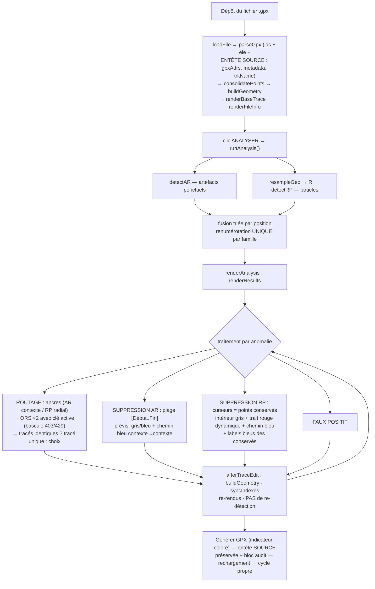

# Spécification de l'application — Présentation, correction, export

> **IHM — V2.0**
> Spécification complète et autonome de l'interface d'audit de traces
> GPX autour des détecteurs d'anomalies AR et RP (spécifiés dans
> **ANALYSE V1.0**). Ce document définit : le cycle utilisateur, la
> présentation des anomalies (carte, liste, synthèse, étiquettes), les
> trois corrections — **routage OpenRouteService**, **suppression de
> points** avec prévisualisations pas à pas, **faux positif** —
> l'annulation, la règle d'imbrication, les verrous, les **échanges
> d'entrée/sortie** (import GPX avec préservation de l'entête source,
> requêtes OpenRouteService, export GPX enrichi d'un bloc d'audit), la
> gestion d'erreurs et le jeu de régression « jusqu'au rendu ».
>
> L'application est mono-fichier (HTML + CSS + JavaScript ES6) avec
> **Mapbox GL JS 3.7.0** pour la cartographie ; tout le traitement est
> local. Seule exception : une demande de routage explicitement
> déclenchée transmet deux coordonnées à OpenRouteService.
>
> **Changements V1.0 → V2.0** : migration de Leaflet 1.9.4 vers Mapbox
> GL JS 3.7.0 (fond de carte, sources GeoJSON, layers WebGL, markers
> HTML, popups uniques sur features, `dragPan` en remplacement de
> `dragging`, `project`/`unproject` en remplacement de
> `latLngToLayerPoint`/`layerPointToLatLng`). Ajout d'une **clé API
> Mapbox** (champ dédié, persistance `localStorage`, réinit de la carte
> au changement). Ajout du helper `geoLngLat` (`[lon, lat]` pour
> Mapbox) à côté de `geoLatLonObj` (`{lat, lon}` métier). La **section
> Clés API** devient une boîte repliable (fermée par défaut) avec badge
> `n/3`. Les algorithmes (ANALYSE), le moteur de correction
> (CORRECTIONS) et les contrats réseau/fichiers restent **inchangés**.
>
> Documents associés : **ANALYSE V1.0** (détecteurs AR et RP — contrat
> d'entrée des findings, §4) ; **CORRECTIONS V1.0** (moteur de
> correction au niveau des données — réalignement, transformations,
> annulation, invariants). Découpage des responsabilités : IHM décrit
> *ce que l'utilisateur voit et manipule* ; CORRECTIONS décrit *ce que
> devient la donnée* (structures d'état, pseudocodes de transformation
> et de restauration, invariants).

---

## Table des matières

1. [Objet, principe du flux batch](#1)
2. [Hypothèses d'amont — le contrat des findings](#2)
3. [Architecture de l'application](#3)
4. [Cycle utilisateur complet](#4)
5. [Présentation des anomalies](#5)
6. [Panneau d'action](#6)
7. [Correction par routage OpenRouteService](#7)
8. [Correction par suppression — AR](#8)
9. [Correction par suppression — RP](#9)
10. [Faux positif](#10)
11. [Annulation d'une correction](#11)
12. [Règle d'imbrication](#12)
13. [Verrous, bouton « Générer GPX », export](#13)
14. [Gestion d'erreurs](#14)
15. [Chromatique — table de référence](#15)
16. [Scénarios de régression « jusqu'au rendu »](#16)
17. [Import d'un fichier GPX — contrat d'entrée](#17)
18. [Échanges avec OpenRouteService — contrat réseau](#18)
19. [**Clé API Mapbox — stockage et UI**](#19)
20. [Export GPX — contrat de sortie](#20)
21. [Invariants d'interface](#21)

---

<a name="1"></a>
## 1. Objet, principe du flux batch

### 1.1 Objet

L'application permet, sur une trace GPX chargée :

1. **détecter** les anomalies (bouton ANALYSER — voir ANALYSE V1.0) ;
2. **présenter** les anomalies détectées (carte, liste, synthèse) ;
3. **corriger** chaque anomalie par l'un des trois traitements :
   routage (remplacement de la zone par un tracé routier),
   suppression de points (avec prévisualisation), ou faux positif
   (l'anomalie est conservée telle quelle) ;
4. **annuler** toute correction, par anomalie ;
5. **exporter** un GPX corrigé lorsque l'utilisateur l'estime achevé —
   en **préservant l'entête du fichier source** et en y adjoignant un
   bloc d'audit horodaté (§20).

### 1.2 Principe du flux batch

Les corrections s'accumulent sur la **trace de travail** **sans
re-détection**. Quand l'utilisateur a traité ce qu'il souhaite, il
génère un nouveau GPX et le recharge : la ré-analyse s'effectue alors
sur un cycle propre. Les détecteurs ne sont jamais relancés pendant un
cycle.

**Verrou** : `isProcessed()` est vrai dès qu'au moins un finding a un
statut ≠ `'pending'`. Tant qu'il est vrai, le bouton ANALYSER est
désactivé (tooltip explicatif) et toute demande d'analyse est refusée.
Sortie du cycle : « Générer GPX » puis rechargement du fichier
(`resetAnalysis` réinitialise l'intégralité de l'état).

**Responsabilité** : l'application ne modifie jamais elle-même la
logique de détection ; elle consomme les findings et maintient, par
traduction d'identifiants, leur validité sur la trace éditée (§3.3 —
spécification complète du réalignement : CORRECTIONS V1.0 §3).

### 1.3 Import

Zone de dépôt (clic, clavier Entrée/Espace, ou glisser-déposer plein
écran avec overlay et compteur de profondeur de drag). Contrôle
d'extension `.gpx` ; lecture locale (FileReader) ; les points sont
munis d'un **identifiant stable séquentiel** alloué au chargement
(`nextPointId++`), jamais recyclé ; `<ele>` conservé si numérique.
**L'entête du fichier source est capturée au chargement** (balise
`<gpx>` avec tous ses attributs, `<metadata>` éventuel, `<name>` de la
trace — §17.3) afin d'être réémise à l'identique à l'export (§20).
La consolidation (seuil `p-consol`, cf. ANALYSE §2.3) est exécutée à
l'import (première trace de travail) puis à chaque analyse
(reconstruction depuis la trace brute — impossible si des corrections
existent, verrou §1.2). La trace brute n'est **jamais** modifiée.
**Contrat d'entrée détaillé : §17.**

---

<a name="2"></a>
## 2. Hypothèses d'amont — le contrat des findings

Le module de correction consomme les findings produits par ANALYSE
V1.0 (§4 de ce document). Rappel des champs consommés :

| Champ | AR | RP | Usage dans l'IHM |
|---|---|---|---|
| `kind` | `'ar'` | `'rp'` | sélecteur de tous les comportements spécifiques (rendu, ancres, prévisualisation) |
| `label` | « Aller-retour : n » | « Boucle giratoire : n » / « Tour de rond-point : n » | liste, titres de popups et de panneau |
| `summary` | sommet · paires · écart | jonction · angle (turnText) · paires | popup de l'emprise, régénéré après édition |
| `peak` / `peakId` | sommet | jonction (1ᵉʳ point du cœur) | callout, centrage |
| `pairs[]` | `{ aid, bid, a, b, d }` | idem (top 6 par distance) | textes des parts, popups |
| `parts[0]` | emprise `[s..e]` | emprise `[sRef..eRef]` | trait rouge / zone, sliders de suppression |
| `parts[1]` | cœur = sommet ±1 | cœur = la boucle `[csRef..ceRef]` | trait d'info / cœur épais, bornes par défaut du routage AR |
| `ctx` / `ctxIds` | points sains adjacents | idem | marqueurs verts, ancres par défaut du routage AR |
| `coreIds` | — | la boucle | rendu du cœur, prépositionnement routage RP |
| `totalAngle`, `turnText` | — | angle quantifié + libellé | summary, popup du cœur |

Après chaque édition de la trace, l'application re-traduit les
identifiants en index courants et régénère les textes depuis les
mesures **invariantes** (`pairs`, `ecart`, `totalAngle`, `turnText`) —
§3.3.

---

<a name="3"></a>
## 3. Architecture de l'application

### 3.1 Blocs fonctionnels

| Bloc | Responsabilité | Fonctions principales |
|---|---|---|
| Diagnostique | Visibilité des erreurs, contrôle Mapbox GL JS | traps `error`/`unhandledrejection`, garde CDN (`typeof mapboxgl === 'undefined'`) |
| Constantes | Chromatique, seuils prévisualisation, identité ORS, ancres RP, **style Mapbox**, **entête d'export** | blocs `SEL_A/B`, `ANCHOR_A/B`, `ROUTE_COLORS`, `APPLIED_COLOR`, `DEL_*_COLOR` (lues des variables CSS `--del-*`), `ROUTE_SAME_*`, `RP_ANCHOR_*`, `MAPBOX_STYLE_DEFAULT`, `MAPBOX_FALLBACK_CENTER`, `MAPBOX_FALLBACK_ZOOM`, `GPX_AUDIT_NS`, `GPX_APP_DEFAULT` |
| Données | Parse GPX (ids + ele + **entête source préservée**), consolidation, géométrie | `parseGpx`, `consolidatePoints`, `buildGeometry`, `loadFile` |
| Détecteurs | AR + RP (cf. ANALYSE V1.0) | `runAnalysis` (orchestration bicateur) |
| Ancres RP | Entrée/sortie de routage, profil radial (lazy) | `rpAnchors(f)` |
| **Carte Mapbox** | Création/destruction de la carte, `mapboxgl.accessToken`, cycle `load`, file d'attente `whenMapReady`, réinit au changement de clé | `initMap`, `destroyMap`, `onMapboxKeyChange`, `whenMapReady`, `replayCurrentState` |
| **Registres de couches** | Sources GeoJSON + layers WebGL, empilement explicite, update/clear | classe `LayerRegistry` ; instances `traceRegistry`, `appliedRegistry`, `previewRegistry`, `anomalyRegistry`, `deleteRegistry` |
| **Marqueurs HTML** | Étiquettes, croix Kåsa, curseurs de sliders (drag, popups) | `showPointLabels`, `makeLabelDraggable`, `setSliderMarkers`, `clearSliderMarkers`, `clearLabelLayers` |
| Corrections | Routage, suppression AR/RP, faux positif, undo, imbrication | §7 à §12 |
| Rendus | Carte, liste, synthèse, callouts | `renderAnalysis`, `renderResults`, `renderSummary`, `fanItems`, `radialOffsets`, `rpLabelItems`, `showStandardLabels` |
| Panneau d'action | Six vues de correction | `showView`, `showActionPanel`, `hideActionPanel`, `selectFinding` |
| Export | GPX corrigé avec entête source + bloc audit | `buildMetadataXml`, `buildGpxXml`, `generateGpx`, `appName`, `isoNow` |
| IHM | Import, sliders paramétrables, **clé Mapbox + deux clés ORS**, nom d'application, badge `n/3` | `resetAnalysis`, `store`, `updateApiKeysBadge`, écouteurs |

### 3.2 État global

```js
state = {
  fileName,          // nom du fichier importé
  raw,               // points du FICHIER — jamais modifiés
  sourceMetaXml,     // <metadata> du SOURCE (chaîne XML brute) — null si absent
  sourceGpxAttrs,    // attributs de la balise <gpx> du SOURCE (chaîne) — null si absents
  sourceTrkName,     // <name> de la trace du SOURCE (texte brut) — null si absent
  working,           // trace de TRAVAIL (consolidée puis corrigée)
  geo,               // géométrie métrique sur working
  analysis,          // { findings, geo, params, ms } — AR et RP (kind)
  consol, consolRemoved, selected   // selected = finding affiché au panneau
}
analyzedSignature      // signature des SLIDERS à la dernière analyse (indicateur « dirty »)
nextPointId            // allocation des ids (parse puis routage)
pendingRoutes          // { car, bike, start, end, identical } — routage en attente de choix
orsCtl                 // AbortController de la requête en cours (null = au repos)
orsActive              // 'a' | 'b' — clé ORS active (persistée)
map                    // instance mapboxgl.Map | null (aucune si clé absente ou carte détruite)
mapboxReady            // bool — map.on('load') reçu
mapReadyQueue          // fonctions en attente du load du style (whenMapReady)
currentPopup           // mapboxgl.Popup unique (features) — ou null
```

État non nommé mais persistant (registres + collections) :

```js
traceRegistry, appliedRegistry, previewRegistry, anomalyRegistry, deleteRegistry
sliderMarkers          // 2 mapboxgl.Marker (Début / Fin)
labelMarkers           // étiquettes HTML + traits de liaison (markers + features)
labelLeaderFeatures    // features LineString des traits de liaison
```

Chaque finding, au moment du rendu, reçoit une propriété technique :

```js
f._render = { points: Feature[], lines: Feature[] }   // features GeoJSON du finding
f._htmlMarkers = mapboxgl.Marker[]                    // croix Kåsa, etc.
```

Ces deux structures vivent **le temps du rendu** (effacées par `clearAnalysisLayers`) et sont la source unique de la vérité visuelle. L'état métier du finding (statut, emprise, paires) reste inchangé.

Constantes d'export : `GPX_AUDIT_NS = 'http://VérificationGPX.example/gpx/audit/1'`
(namespace du bloc d'audit — modifiable en tête de script) ;
`GPX_APP_DEFAULT = 'VérificationGPX'` (nom d'application par défaut).

Constantes Mapbox :

```js
MAPBOX_STYLE_DEFAULT   = 'mapbox://styles/mapbox/outdoors-v12'
MAPBOX_FALLBACK_CENTER = [2.6, 46.6]   // [lon, lat] — France
MAPBOX_FALLBACK_ZOOM   = 6
```

### 3.3 Réalignement des index (`syncIndexes`)

Après **toute** modification de `state.working` :

```text
idx ← Map( id → index courant )
pour chaque finding f non 'corrected' :
    s ← idx[f.zoneIds[0]] ; e ← idx[f.zoneIds[dernier]] ; pk ← idx[f.peakId]
    si l'un manque : erreur console, finding inchangé
    f.parts[0].s ← s ; f.parts[0].e ← e ; f.peak ← pk
    AR : f.parts[1] ← [pk−1, pk+1] (borné à la trace)
    RP : f.parts[1] ← [idx[f.coreIds[0]], idx[f.coreIds[dernier]]]
    f.pairs[k].a/b ← idx[aid/bid] ; f.pairIdx ← aplati
    f.ctx.up/dn ← idx[ctxIds] (null si id disparu)
    rebuildTexts(f)          // textes régénérés depuis les mesures invariantes
findings triés par parts[0].s croissant
```

**Garanties.** La traduction par ids est correcte quel que soit l'ordre
et le mélange des corrections et annulations. La spécification formelle
complète — pseudocode intégral, garanties détaillées, condition de
validité, gabarits de régénération des textes — est établie dans
**CORRECTIONS V1.0 §3** ; l'invariant de reconstruction de la géométrie
(`geo.ids[i] = working[i].id` après toute édition) dans **CORRECTIONS
V1.0 §4 et §10 (C4)**.

`afterTraceEdit(f, detail)` enchaîne après chaque édition : rebuild
`geo` → `syncIndexes` → re-rendus (trace sans recadrage, fileinfo,
carte, liste) → nettoyage callouts/marqueurs → `updateLocks` (re-
coloration du bouton Générer) → toasts (détail, points, restantes ;
« toutes traitées » si 0 pending) → panneau en vue « annuler ».

### 3.4 Couches Mapbox — sources, layers, ordre d'empilement

Mapbox GL JS n'a **pas** de système de panes nommés ; l'empilement est
déterminé par **l'ordre d'ajout des layers** au style (bas → haut).
Toutes les couches sont ajoutées une seule fois au `map.on('load')`
(§3.7) et leur donnée est mise à jour par `source.setData(fc)`.

Ordre d'empilement retenu (1 = le plus bas) :

| # | Id de layer | Contenu | Type | Équivalent Leaflet V1.0 |
|---|---|---|---|---|
| 1 | `lyr-applied` | Routage appliqué (bleu clair, w8) — **sous la trace** | ligne | `routeAppliedPane` (z390) |
| 2 | `lyr-trace` | Trace de base (bleu `#3564e0`, w3) | ligne | `tracePane` (z395) |
| 3 | `lyr-trace-ends` | Marqueurs Départ / Arrivée | cercle | idem |
| 4 | `lyr-preview-car` | Aperçu routage voiture (jaune, w10) | ligne | `routeCarPane` (z400) |
| 5 | `lyr-preview-car-pts` | Points intermédiaires voiture | cercle | idem |
| 6 | `lyr-preview-bike` | Aperçu routage vélo (orange, w6) | ligne | `routeBikePane` (z405) |
| 7 | `lyr-preview-bike-pts` | Points intermédiaires vélo | cercle | idem |
| 8 | `lyr-anomaly-lines` | Traits des anomalies (zone, cœur, emprise AR) | ligne | `anomalyPane` (z420) |
| 9 | `lyr-anomaly-points` | Points des anomalies (emprise, cœur, contexte, ancres, bornes, points d'origine) | cercle | idem |
| 10 | `lyr-del-red` | **Trait rouge dynamique** de la plage supprimée (RP) | ligne | `joinPane` (z430) |
| 11 | `lyr-del-join` | **Chemin bleu** des points conservés (AR + RP) | ligne | `keepPane` (z440) |
| 12 | `lyr-label-leaders` | Traits de liaison des étiquettes | ligne | (DOM V1.0) |
| — | markers HTML (`mapboxgl.Marker`) | Étiquettes, croix Kåsa, curseurs de sliders | DOM | au-dessus du canvas WebGL |

**Conséquences pratiques** :

- Toute la coloration/épaisseur des features passe par **data-driven
  styling** (`['get','color']`, `['get','width']`, `['get','radius']`,
  `['get','fill']`, `['get','stroke']`, `['get','strokeWidth']`) : un
  même layer porte des features hétérogènes, chacune décrite par ses
  propriétés.
- La prévisualisation de suppression (AR et RP) ne crée/détruit aucun
  layer : elle **mute les propriétés de features** (`fill`,
  `radius`, `strokeWidth`, `popupHtml`) puis appelle
  `anomalyRegistry.update('lyr-anomaly-points', fc)` — voir §8.2 et
  §9.2.
- Les **points individuels** ne portent pas de popup en propre
  (contrairement à `bindPopup` par `circleMarker` en V1.0) : le clic
  est capté au niveau du layer via `map.on('click','lyr-anomaly-points',
  handler)`, le handler lit `f.properties.popupHtml` et appelle
  `showPopupAt(e.lngLat, html)` (popup unique, §3.6).

### 3.5 Registres de couches — remplacement des `layerGroup`

Les 5 `L.layerGroup` de V1.0 sont remplacés par 5 instances de la
classe `LayerRegistry` (une par groupe fonctionnel). Chaque registre
possède sa propre `Map` interne `id → { source, layer }`.

| Registre V2.0 | Contenu | Équivalent V1.0 |
|---|---|---|
| `traceRegistry` | Trace + Départ/Arrivée | `traceGroup` |
| `appliedRegistry` | Routage appliqué d'une anomalie corrigée | (couche unique) |
| `previewRegistry` | Aperçus de routage en attente de choix | `routeGroup` |
| `anomalyRegistry` | Traits et points des anomalies | `analysisGroup` (partiel) |
| `deleteRegistry` | Chemin bleu + trait rouge dynamiques | `analysisGroup` (partiel) |

API minimale :

```js
add(id, fc, layerSpec, onClick)   // crée source + layer, enregistre le handler
update(id, fc)                    // source.setData(fc) — no-op si source absente
remove(id)                        // retire le layer PUIS la source
clear()                           // retire tous les éléments du registre
reset(map)                        // détache et vide (utilisé à la destruction de la carte)
```

**Point de contrat — ordre `removeLayer` → `removeSource`** : Mapbox
refuse de supprimer une source référencée par un layer encore présent.
Le helper `remove()` garantit cet ordre. Toute suppression de couche
passe par lui.

**Point de contrat — idempotence** : un `add()` sur un id déjà présent
se réduit à un `update()`. Cela rend le rendu résilient à un
double-appel (re-rendu après `syncIndexes`, replay après `load`, etc.).

### 3.6 Popups — un popup unique pour les features

V1.0 : un popup attaché par couche (`bindPopup` par `circleMarker` et
par polyligne). V2.0 : **un seul popup actif à la fois**, ouvert
programmatiquement au clic sur une feature.

```js
let currentPopup = null;
function showPopupAt(lngLat, html){
  if (currentPopup){ currentPopup.remove(); currentPopup = null; }
  if (!html) return;
  currentPopup = new mapboxgl.Popup({ offset: 10, maxWidth:'320px' })
    .setLngLat(lngLat).setHTML(html).addTo(map);
}
```

Chaque handler de clic lit `e.features[0].properties.popupHtml` et
appelle `showPopupAt(e.lngLat, html)`. **Aucune** feature de layer ne
porte de popup propre.

Les **markers HTML** (étiquettes, croix Kåsa, curseurs de sliders)
conservent en revanche leur popup individuel via
`marker.setPopup(new mapboxgl.Popup().setHTML(...))` — sémantique
identique à V1.0.

### 3.7 Cycle de vie de la carte

Trois états :

| État | Déclencheur | Conséquence |
|---|---|---|
| **Absente** | Aucune clé Mapbox saisie au démarrage, ou champ vidé | `map === null`, `mapboxReady === false` ; l'overlay `#mapPlaceholder` est **visible** (fond neutre `#dfe3e8`, message explicatif). Trace, anomalies et corrections restent pleinement fonctionnelles dès qu'une clé est saisie. |
| **En cours de chargement** | `initMap()` appelé avec une clé ; `map.on('load')` pas encore déclenché | `map` instancié, `mapboxReady === false`. Toute opération de rendu qui touche aux sources/layers est **mise en file d'attente** via `whenMapReady(fn)` |
| **Prête** | `map.on('load')` reçu | `mapboxReady === true`, registres attachés, couches initialisées, **file d'attente vidée** (les fonctions accumulées s'exécutent dans l'ordre), état courant rejoué (`replayCurrentState`) |

**`whenMapReady(fn)`** est appelé au début de `renderBaseTrace` et
`renderAnalysis` : si la carte est prête, exécution immédiate ; sinon,
mise en file. Le vidage se fait à `load` **avant** `replayCurrentState`.

**Changement de clé** (`change` sur `#mapboxKey`) — séquence :

1. `refreshMapboxKeyUI()` (badge + point vert).
2. Mémorisation de la vue courante (`getCenter()`, `getZoom()`) si
   une carte existe.
3. `destroyMap()` — retire popups, markers, registres, puis
   `map.remove()` ; remet `map = null` et `mapboxReady = false`.
4. Si la nouvelle clé est vide → placeholder affiché ; sinon
   `initMap(view)` avec restauration de la vue mémorisée.

**Rejeu d'état** : à chaque `load`, `replayCurrentState()` ré-exécute
`renderBaseTrace(false)` puis, si une analyse est chargée,
`renderAnalysis()`. Une **prévisualisation en cours** (routage non
appliqué, suppression non validée) est perdue — comportement assumé :
changer de clé en pleine prévisualisation est rare, et la relancer
suffit.

### 3.8 Conversions de coordonnées — trois conventions

Trois helpers coexistent, à ne **jamais** confondre :

| Helper | Retour | Usage |
|---|---|---|
| `geoLatLonObj(g, i)` | objet `{lat, lon}` | **Métier** : popups, textes de synthèse, **contrat ORS** (`orsRoute` reçoit `{lat, lon}`) |
| `geoLngLat(g, i)` | tuple `[lon, lat]` | **Mapbox** : sources GeoJSON, `LngLatBounds`, `Marker.setLngLat`, `map.project`/`unproject` |
| `working[i].lat` / `.lon` | accès direct | quand on a déjà l'objet point |

**Contrat ORS** (rappel §18.2) : `orsRoute(profile, aLL, bLL, …)`
attend des objets `{lat, lon}` et sérialise lui-même au format ORS
`[lon, lat]` pour la requête HTTP.

---

<a name="4"></a>
## 4. Cycle utilisateur complet



**Renumérotation par famille.** Les détecteurs produisent des labels
nus (« Aller-retour », « Boucle giratoire », « Tour de rond-point ») ;
`runAnalysis` suffixe ` : n` avec un compteur **par libellé** — une
seule renumérotation, dans un seul endroit. Les labels sont ensuite
invariants pendant le cycle.

---

<a name="5"></a>
## 5. Présentation des anomalies

### 5.1 Rendu carte par kind × statut

Toutes les géométries sont des **features GeoJSON** injectées dans les
sources `lyr-anomaly-lines` et `lyr-anomaly-points`. Chaque feature
porte ses propriétés visuelles (`color`, `width`, `radius`, `fill`,
`stroke`, `strokeWidth`, `popupHtml`). Les layers sont **data-driven**
(§3.4) : un layer unique porte des features hétérogènes.

**AR — à traiter (`pending`)** :

| Élément | Règle exacte |
|---|---|
| Trait d'emprise | feature `LineString` sur `parts[0]`, propriétés `{ color: #dd3327, width: 5, opacity: 0.95 }` ; `popupHtml` = label + summary + « Points : s → e » |
| Points d'emprise | features `Point` sur `[s..e]`, `{ radius: 4, fill: #dd3327, stroke: #ffffff, strokeWidth: 1.5 }` ; `popupHtml` = « pt N » + lat/lon à 5 décimales. **Chaque feature porte aussi `_idx`** (index de trace) — utilisé par la prévisualisation de suppression |
| Points de contexte | features `Point` `{ radius: 5, fill: #3ecf8e, stroke: #ffffff, strokeWidth: 1.5 }` ; popup « pt N · amont/aval (sain) » |

**RP — à traiter** :

| Élément | Règle exacte |
|---|---|
| Trait de zone | feature `LineString` sur l'emprise `[s..e]`, `{ color: #dd3327, width: 2.5, opacity: 0.8 }` ; popup = label + summary + « Emprise : s → e » |
| Trait de cœur | feature `LineString` sur `coreIds`, `{ color: #dd3327, width: 5, opacity: 0.95 }` ; popup = label + texte du cœur + « Cœur : cs → ce » |
| Points d'emprise | features `Point` sur `[s..e]`, `{ radius: 2.5, fill: col, stroke: #ffffff, strokeWidth: 1 }` ; chaque feature porte `_idx` (nécessaire à la prévisualisation de suppression) |
| Ancres de routage | features `Point` sur `[s..e]` avec `{ radius: 7, fill: #c084fc (amont) / #7e22ce (aval), stroke: #ffffff, strokeWidth: 2 }` ; popup dédié (« ancre de routage amont/aval — début/fin de la zone remplacée par défaut » + lat/lon). Calcul **lazy** (`rpAnchors(f)`), recalculé à chaque rendu sur la trace courante |
| **Croix du centre** | `mapboxgl.Marker` HTML (élément `div.rp-x`, texte `✕` jaune 16 px, `transform: translate(-50%,-50%)`), `anchor: 'center'` ; popup individuel via `marker.setPopup(...)` — « Centre de l'anneau (ajustement de cercle) », rayon médian ≈ N m, lat/lon |
| Points de contexte | features `Point` `{ radius: 5, fill: #3ecf8e, … }` — comme l'AR |

La **jonction** RP est un point **ordinaire** de l'emprise (aucune
particularisation) — information portée par le `summary` et le popup
du cœur.

**Faux positif (`fp`, les deux familles)** : même dessin en bleu clair
`#6ea8ff`, **sans contexte**. La trace n'est jamais modifiée.

**Corrigé (`corrected`)** — cf. §7.6 (routage) et §8.4/§9.4
(suppression) : les points d'origine sont matérialisés en **gris**
(features `Point` `{ radius: 3.5, fill: #8a919c, stroke: #ffffff,
strokeWidth: 1.2, popupHtml: "Point d'origine · ex-pt N" }`),
persistants jusqu'à l'annulation ; en cas de routage, s'ajoutent le
tracé appliqué (`lyr-applied`) et les bornes jaune/orange (features
`Point` dans `lyr-anomaly-points`).

`bounds` de chaque finding : `LngLatBounds` couvrant l'emprise courante
(+ contexte) ; pour une anomalie corrigée par routage, étendu au tracé
appliqué — le centrage cadre la correction entière.

### 5.2 Liste des résultats

Article `.seg` par finding, **ordre de trace** : nom (label renuméroté)
+ tag de statut. Clic → sélection (§6.4). Tags :

| Statut | Tag | Classe |
|---|---|---|
| `pending` | À traiter | rouge `st-pending` |
| `fp` | Faux positif | jaune `st-fp` |
| `corrected:delete` | Points supprimés | vert `st-ok` |
| `corrected:route-bike` | Routage vélo | vert `st-ok` |
| `corrected:route-car` | Routage voiture | vert `st-ok` |

À traiter = opacité pleine ; traité = opacité 0,75.

### 5.3 Synthèse

Boîte dépliable au-dessus du bouton Générer. Badge : nombre
d'anomalies. Lignes : Anomalies · Aller-retours · Boucles giratoires ·
À traiter · Faux positifs · Points supprimés · Routage vélo · Routage
voiture · Points trace · Distance (1 décimale, km). Compteurs dérivés
des statuts, recalculés à chaque transition.

### 5.4 Étiquettes (callouts)

Étiquettes flottantes numérotées (n° du point, base 1), **draguables**
(pointer events + capture, pan de carte désactivé pendant le drag,
double-clic = retour à la position par défaut), chacune reliée à son
point par un **trait de liaison** coloré selon la classe.

**Implémentation Mapbox V2.0** :

- Chaque étiquette est un **`mapboxgl.Marker` HTML** (`{ element: div,
  anchor: 'center' }`) contenant `<span class="pt-label">N</span>`.
- Le trait de liaison est une **feature `LineString`** dans la source
  dédiée `lyr-label-leaders` (`labelLeaderFeatures`), mise à jour à
  chaque événement de carte (`move`, `zoom`, `resize`).
- `updateLabelLine(it)` calcule les extrémités du trait via
  `map.project(lngLat)` puis `map.unproject({x, y})` — équivalents
  respectifs de `latLngToLayerPoint` et `layerPointToLatLng` (V1.0).
- **Désactivation du pan** : `map.dragPan.disable()` au
  `pointerdown`, `map.dragPan.enable()` au `pointerup` (ou
  `pointercancel`, ou `lostpointercapture`). Équivalent exact de
  `map.dragging.disable/enable`.
- `refreshLabelLeaders()` filtre les traits de liaison dont
  l'étiquette est masquée (`opacity: 0`) et republie la source.

| Classe | Usage | Trait | Style de l'étiquette |
|---|---|---|---|
| `''` | point ordinaire (AR, RP) | gris neutre | fond sombre, liseré standard |
| `pk` | sommet AR | rouge | bord rouge, texte rouge, plus grande |
| `ctx` | point sain | vert | bord vert, texte vert |
| `del` | point d'origine d'une correction | gris | fond gris, texte gris clair |
| `fpl` | point d'un faux positif | bleu clair | fond bleu sombre, texte bleu clair |
| `keep` | point conservé (prévis. suppression RP) | bleu clair | bord bleu clair, texte bleu très clair |

**Placement AR (éventail)** — inchangé : offsets croissants par rang,
sommet à `(0, −84)`, contexte en prolongement.

**Placement RP (radial)** — inchangé (règle validée) : normale
extérieure à la tangente locale, quinconce 60/84, couronnes +24 par
jumeau métrique < 8 m, repli radial si tangente indéterminée,
conversion métrique (est, nord) → écran (`dx = +nx·d`, `dy = −ny·d`).

**Sélection des points étiquetés RP** (`rpLabelItems`) : un point sur
`k` au-delà de 120 (`LABEL_MAX`, stride), avec étiquetage systématique
des jalons — bornes d'emprise, ancres, jonction.

**Labels d'une anomalie corrigée** : AR → éventail `del` sur les points
d'origine ; RP → règle radiale sur les points d'origine, classe `del`
**uniforme** (y compris l'ex-jonction), ex-jonction toujours étiquetée,
stride si > 120 points.

---

<a name="6"></a>
## 6. Panneau d'action

Panneau ancré en haut à droite de la carte, six vues exclusives
(`showView` masque les cinq autres). Titre : « label · pts s → e »
(anomalie en cours) ou label seul (corrigée).

| Vue | Condition | Contenu |
|---|---|---|
| `apMain` | `pending` | 🧭 Demande de routage · ✂ Suppression de points · 🚫 Faux positif |
| `apRouteSel` | `pending` | note d'aide · sliders Début/Fin (« pt N ») · Demander le routage / Annuler |
| `apChoice` | réponse ORS reçue | radios Voiture/Vélo (ou « tracé unique », §7.3) + métriques + Appliquer / Annuler |
| `apDelSel` | `pending` | note d'aide · sliders Début/Fin + prévisualisation · Supprimer / Annuler |
| `apFpMode` | `fp` | note + « Retirer le marqueur » |
| `apUndoMode` | `corrected` | note (type de correction) + « ↩ Annuler la correction » |

**Marqueurs de sliders** (`setSliderMarkers`) : deux `mapboxgl.Marker`
HTML — élément `div` de 14×14 px, bordure blanche 2 px, fond coloré
(jaune/orange par défaut, bleu en prévisualisation de suppression),
`title` = tooltip natif du navigateur (« Début · pt N » / « Fin · pt
N »). Positionnés en live à chaque mouvement de slider.
`clearSliderMarkers` à toute sortie de vue.

Sorties de vue : « Annuler » de la vue routage stoppe toute requête
ORS en cours (`stopOrs`) ; fermeture du panneau (`hideActionPanel`)
exécute en outre la restauration de prévisualisation de suppression
(`delClose`, §8.4/§9.5) et vide `pendingRoutes`.

**Sélection d'une anomalie dans la liste** (`selectFinding`) : tout
sous try/catch (toast + console) ; centrage `map.fitBounds(bounds,
{ padding: 80, maxZoom: 18, duration: 500 })` (emprise + contexte, ou
points d'origine/tracé appliqué si corrigée) ; labels standards ;
panneau.

---

<a name="7"></a>
## 7. Correction par routage OpenRouteService

### 7.1 Ancres par défaut et bornage des sliders

| Famille | Ancres par défaut (Début / Fin) |
|---|---|
| AR | points de contexte sain `ctx.up` / `ctx.dn`, sinon bornes d'emprise `s` / `e` |
| RP | ancres **radiales** (`rpAnchorIndices`, lazy) — les routes droites encadrant la boucle ; la zone remplacée par défaut couvre courbes d'insertion/sortie + anneau ; repli : `cs−1` / `ce+1` |

Bornage des sliders (les deux familles) :

```
lo = 0 ; hi = M − 1
pour chaque autre finding g non 'corrected' :
    si g se termine avant f : lo = max(lo, g.fin + 1)
    si g commence après f  : hi = min(hi, g.début − 1)
Début : min = max(0, lo, ancre_amont − 3)   max = min(fin − 1, hi)
Fin   : min = max(0, lo, ancre_amont − 3) + 1   max = min(M − 1, hi, ancre_aval + 3)
valeurs initiales = ancres par défaut ; clamp en live : start ≤ end − 1
```

Les ancres Début/Fin sont **conservées** dans la trace ; ±3 points
d'extension ; impossible de mordre une anomalie voisine non corrigée.

### 7.2 Requête, timeout, annulation, deux clés

Résumé fonctionnel (le **contrat réseau complet** — URL, corps,
réponse, mapping, codes — est spécifié en **§18**) :

**Requête** : `POST …/v2/directions/{profile}/geojson`, deux profils en
parallèle (`driving-car`, `cycling-road`), corps à deux coordonnées
avec `elevation: true`. **Timeout** 12000 ms via `AbortController` ;
pendant l'attente, le bouton « ⏳ ORS… (cliquer pour annuler · 12 s
max) » permet l'annulation, relance immédiate. **Deux clés** (n°1
principale / n°2 secours, persistées) : en cas d'échec total avec au
moins un 403/429 et une clé de secours existante, **bascule
automatique** sur l'autre clé + toast + relance (timeout frais) ; 2ᵉ
échec 403/429 → toast dédié ; timeout/réseau → **pas** de bascule. Un
seul profil réussi suffit (l'autre grisé). L'annulation utilisateur est
prioritaire à tout instant.

### 7.3 Tracés identiques

`routesIdentical(car, bike)` — deux critères, tous deux requis :

1. longueurs totales (`summary.distance`) à **2 %** relatif près ;
2. **distance de Hausdorff discrète** point→segment dans les **deux
   sens** ≤ **15 m** (projection locale équirectangulaire ; le test
   point→segment absorbe les différences de densité d'échantillonnage
   entre les deux réponses).

Si identiques : les radios sont **masqués**, la note « Tracé unique —
voiture et vélo de route identiques (X km) » s'affiche, un seul tracé
d'aperçu (jaune, w9), et « Appliquer » branche directement sur le
tracé voiture sans lire les radios.

Si différents : radios visibles (Voiture **jaune** / Vélo de route
**orange**, textes colorés ; indisponible grisé et désactivé),
métriques (km à 2 décimales, virgule FR ; durée `45 s` / `12 min` /
`1,5 h`), défaut = voiture (ou le profil disponible). Aperçu : voiture
w10 au-dessus de vélo w6 (layers 4 et 6, §3.4), points intermédiaires
r4/r3.

### 7.4 Application (`applyRoute`)

```text
val = 'driving-car' si tracés identiques, sinon radio coché
guard : nestingGuard(f, start+1, end−1) → refus toasté si morsure (§12)
absorbed = absorbFpFindings(f, start+1, end−1)    // §12.3
inner = working[start+1 .. end−1]                 // remplacés
mids  = coords ORS amputées de leurs 2 extrémités // ancres conservées,
        → nouveaux ids, ele ORS conservé          // pas de doublon dans la trace
undo ← { type:'route', origPts: copies de inner, insertedIds: ids de mids,
         routePts: [working[start], ...mids, working[end]],   // tracé RENDU
         startPt: working[start], endPt: working[end],        // bornes RENDU
         firstNo: start + 2, absorbedFp }
working ← working[0..start] ∪ mids ∪ working[end..]
status ← 'corrected' ; correction ← 'route-car' | 'route-bike'
afterTraceEdit(f, « routage voiture/vélo de route »)
```

**`routePts` borné aux ancres exactes** : les coords ORS sont amputées
de leurs extrémités (les ancres ne sont pas dupliquées dans la trace) ;
sans cette extension, le tracé rendu s'arrêtait à court du premier/
dernier vertex ORS, à quelques mètres des ancres. Les points **insérés
dans la trace** restent les `mids` — le nombre de points de l'export
n'est pas affecté par le rendu.
*Transformation de données détaillée (structures `undo`, garde-fous,
pseudocodes) : CORRECTIONS V1.0 §6.*

### 7.5 Aperçu et annulation

`drawRoutePreview` : tracé(s) d'aperçu dans les layers `lyr-preview-car`
et `lyr-preview-bike` (+ leurs layers de points) + cadrage union
(`map.fitBounds(bounds, { padding: 60, maxZoom: 18, duration: 500 })`).
« Annuler » vide les aperçus et revient à `apMain` sans modifier la
trace.

### 7.6 Rendu persistant d'un routage

| Élément | Règle |
|---|---|
| Tracé appliqué | feature `LineString` dans `lyr-applied` — **layer 1** (le plus bas, sous la trace), bleu clair `#6ea8ff`, `line-width: 8`, `line-opacity: 0.9` ; popup « Tracé de routage appliqué (voiture/vélo de route) », points insérés : N |
| Points d'origine | features `Point` grises (comme toute correction) dans `lyr-anomaly-points` |
| **Bornes** | `startPt` / `endPt` en **jaune** / **orange** (features `Point` `{ radius: 3.5, fill: #f0d24a / #ec9c11 }`, ajoutées APRÈS les gris dans le tableau `points` — **l'ordre dans le FeatureCollection détermine la superposition en cas de chevauchement pixel**) |
| Undo | rejoue `origPts` quel que soit le profil appliqué ; le tracé et les bornes disparaissent avec la correction (ils vivent dans `undo`) |

---

<a name="8"></a>
## 8. Correction par suppression — AR

### 8.1 Ouverture

Sliders sur le **domaine commun** `[s..e]` (emprise de l'AR, quelques
points), prépositionnés aux **extrémités** — la plage par défaut
supprime tout. Classe `del-track` posée sur les sliders (pistes peintes
en JS via la variable `--del-track-bg` ; `appearance:none` requis pour
que la piste custom prenne le dessus). Étiquettes standards affichées
(éventail), puis masquage dynamique de la plage (§8.2).

### 8.2 Prévisualisation (`delUpdate` — recalculée à chaque mouvement)

Règle générale : **bleu = sera conservé, gris très clair = sera
supprimé, ligne bleue = la trace telle qu'elle restera**.

| Élément | Règle exacte |
|---|---|
| Points d'emprise | **mutation des propriétés de features** : `f._render.points` filtrés sur `_idx` ; hors `[start..end]` → `fill: #8fc1ff` ; dans la plage → `fill: #d9dde3`. Puis `rebuildAnomalySource()` réinjecte le tableau complet dans `lyr-anomaly-points`. Les popups restent accessibles |
| **Chemin bleu** (`lyr-del-join`, layer 11, w4, bleu `#3564e0`) | du **contexte amont−1** (`max(0, s0−1)`) jusqu'au conservé `start−1` (segments réels), puis des conservés `end+1` jusqu'au **contexte aval+1** (segments réels). La borne `max(0, s0−1)` garantit que le chemin part du point de contexte **même s'il est hors emprise** — à l'ouverture (sliders aux extrémités), le chemin relie les deux contextes verts |
| `lyr-del-red` | vidé (`emptyFC()`) — la prévisualisation AR ne montre **pas** de trait rouge dynamique |
| Curseurs | posés sur les points **conservés** `start−1` / `end+1` (règle « curseur = point qui reste »), **bleus**, tooltips natifs « conservé · pt N » ; **repli** sur la borne supprimée extrême (`start` / `end`) si la plage touche un bout de trace — tooltip « bord de trace · pt N » |
| Pistes de sliders | bleu clair du côté de la **plage supprimée** : à droite du curseur Début, à gauche du curseur Fin — le bleu **se contracte** quand on épargne des points |
| Étiquettes | celles de la plage `[start..end]` masquées (marker `display:none`, trait `opacity: 0` dans la source `lyr-label-leaders`) ; les autres retrouvent leur classe d'origine |

La trace n'est jamais redessinée pendant le réglage — seul le chemin
bleu préfigure le résultat.

### 8.3 Validation (`doDeleteRange` — branche AR)

```text
plage réelle = [start .. end]          // point isolé possible : start = end
clamp : start > end → start = end
nestingGuard(f, start, end) → refus toasté si morsure (§12)
absorbed = absorbFpFindings(f, start, end)
garde : longueur restante ≥ 2, sinon refus toasté
undo ← { type:'delete', origPts: copies de [start..end],
         anchorLeftId: id de start−1 (null en tête),
         anchorRightId: id de end+1 (null en queue), firstNo: start+1,
         absorbedFp }
working ← working sans la plage
status ← 'corrected' ; correction ← 'delete'
afterTraceEdit(f, « suppression de N point(s) ») ; delClose(f)
```
*Transformation de données détaillée (structures `undo`, garde-fous,
pseudocodes) : CORRECTIONS V1.0 §5.*

### 8.4 Rendu persistant et restauration

**Rendu persistant d'une suppression** : **les points d'origine gris
seuls** — ni raccord bleu, ni bornes (décision validée : la trace
raccordée parle d'elle-même). Étiquettes corrigées : éventail `del`
« ex-pt N ».

`delClose(f)` (appelé par « Annuler », « ✕ », et après validation où il
est un no-op sûr) : retrait des classes/variables CSS des sliders,
vidage des sources `lyr-del-join` et `lyr-del-red`, restauration des
propriétés de features (`_baseFill`, `_baseRadius`, `_baseWeight`,
`_anchorPopup`) puis `rebuildAnomalySource()`, retrait des étiquettes
de prévisualisation. La vue « Annuler » réaffiche ensuite les étiquettes
standards.

---

<a name="9"></a>
## 9. Correction par suppression — RP

### 9.1 Modèle retenu (validé)

À la différence de l'AR (petite emprise, plage directe), l'emprise RP
peut compter plusieurs centaines de points. Le modèle retenu inverse la
logique : **à l'ouverture, tout l'intérieur de l'emprise est supprimé** ;
les curseurs **épargnent**. Règle unique : *les points qui portent un
label bleu sont les points qui seront conservés ; tous les points gris
seront supprimés*.

- **Curseur Début** = **dernier point conservé amont** (initialement
  `s0` = première borne d'emprise, adjacente au contexte vert amont) ;
- **Curseur Fin** = **premier point conservé aval** (initialement
  `e0`) ;
- La plage réellement supprimée est `[Début+1 .. Fin−1]` ;
- **Dynamique** : Début **+1** → le point suivant est épargné (bleu +
  label) ; Début **−1** → re-supprimé (gris) ; Fin **−1** → épargné ;
  Fin **+1** → re-supprimé. Les deux curseurs « convergent » vers le
  centre quand on épargne — geste naturel pour « supprimer le tour en
  trop » (ramener Fin au point de refermeture du 1ᵉʳ tour).

### 9.2 Prévisualisation (`rpDelUpdate(f, début, fin)`)

| Élément | Règle exacte |
|---|---|
| Points d'emprise | **mutation des propriétés de features** ; conservés (bleu clair) si `i ≤ début` ou `i ≥ fin` ; gris très clair sinon — **y compris les ancres**, **destylisées** pendant la vue (`radius: 2.5, strokeWidth: 1, popupHtml` neutre « pt N · conservé/à supprimer ») — le tableau visuel est alors exactement : gris = supprimé, bleu = conservé, vert = sain |
| Traits statiques (zone + cœur) | **retirés de `f._render.lines`** pendant la vue — la source `lyr-anomaly-lines` est rejouée sans eux (`rebuildAnomalySource` + rejeu des lignes filtrées) — sinon le rouge statique recouvrirait les points devenus bleus |
| **Trait rouge dynamique** (`lyr-del-red`, layer 10, w5, rouge) | la plage supprimée réelle `[début+1..fin−1]` **le long de la trace** — se contracte à mesure que des points sont épargnés. Invisible (feature LineString absente) si plage vide |
| **Chemin bleu** (`lyr-del-join`, layer 11, w4, bleu) | segments réels conservés `[s0..début]` + **corde directe `début→fin`** + segments réels `[fin..e0]`. À l'ouverture : corde `s0→e0` traversant l'anneau — message immédiat « si je valide, la boucle disparaît ». Le bleu domine le rouge aux croisements (layer 11 > layer 10) |
| Curseurs | bleus r7, posés sur `début` / `fin` (les conservés) |
| **Labels bleus** (`rpDelLabels`) | **un label par point conservé** (classe `keep`, trait bleu clair), placement radial autour du centroïde du cœur (même règle que les callouts RP : normale extérieure, quinconce 60/84, couronnes +24) — **reconstruction complète à chaque mouvement**. À l'ouverture : 2 labels seulement (s0 et e0) |
| Compteurs | `Points conservés : [s0 – début]` (slider Début) et `Points conservés : [fin – e0]` (slider Fin) — affichés à la place des « pt N » |
| Pistes bicolores | Début : **gauche bleue** (conservés) / **droite rouge** (à supprimer) ; Fin : **gauche rouge** / **droite bleue** — symétriques ; l'intersection des deux zones rouges des deux pistes = la plage réellement supprimée |
| Contextes verts | intacts pendant toute la vue |

**Clamp en live** : `fin ≥ début + 1` (les curseurs ne se croisent
jamais ; l'état « rien à supprimer » reste possible et est refusé à la
validation).

Cas d'usage nominal (double tour) : ramener Fin au point de
refermeture du 1ᵉʳ tour → tout ce qui suit devient bleu/étiqueté, le
rouge ne couvre plus que le tour redondant.

### 9.3 Validation (branche RP de `doDeleteRange`)

```text
plage réelle = [début + 1 .. fin − 1]
si vide (fin = début + 1) : REFUS toasté
    « Aucun point à supprimer entre les curseurs — écartez-les d'abord. »
nestingGuard(f, plage) → refus toasté si morsure (§12)
absorbed = absorbFpFindings(f, plage)
garde : longueur restante ≥ 2
undo ← { type:'delete', ... }  (identique AR, ancres = début / fin)
afterTraceEdit(f, « suppression de N point(s) ») ; delClose(f)
```
*Transformation de données détaillée (plage réelle, garde « plage vide »,
structures `undo`) : CORRECTIONS V1.0 §5.*

### 9.4 Rendu persistant

Identique à l'AR : **points d'origine gris seuls** — le raccord est
porté par la trace reconstruite. Étiquettes corrigées RP : règle
radiale sur les points d'origine, classe `del` uniforme, ex-jonction
toujours étiquetée.

### 9.5 Restauration (`delClose` — branche RP)

En plus du commun : restauration des propriétés des **ancres**
(`radius`, `strokeWidth`, `popupHtml` d'origine stockée dans
`_baseRadius`, `_baseWeight`, `_anchorPopup`) et ré-injection dans
`f._render.lines` des **traits statiques** (zone + cœur) précédemment
retirés. Les étiquettes de prévisualisation sont retirées
(`clearLabelLayers`) ; le retour à `apMain` réaffiche les étiquettes
standards.

---

<a name="10"></a>
## 10. Faux positif

`markFp` : `status ← 'fp'` → rendu estompé (bleu clair, sans contexte),
liste/synthèse, retrait des étiquettes, `updateLocks` (bouton Générer
re-coloré), toast, panneau → `apFpMode`. Une anomalie `fp` est laissée
**telle quelle** dans le GPX généré. La trace n'est jamais modifiée.

`unmarkFp` : retour `'pending'`, re-rendus, panneau → `apMain`.

---

<a name="11"></a>
## 11. Annulation d'une correction (`undoCorrection`)

Par anomalie : chaque finding corrigé expose « ↩ Annuler la
correction » (vue `apUndoMode`). Résumé fonctionnel :

**`type = 'route'`** — trois garde-fous successifs (sinon refus
toasté, cause précise) :

1. aucun `insertedId` ne figure dans les `origPts` d'une **autre**
   correction (`usedByOther`) ;
2. le premier id inséré est retrouvé dans `working` ;
3. la séquence `insertedIds` est **contiguë et dans l'ordre** à cette
   position.

Puis remplacement de la séquence par `origPts` (copies).

**`type = 'delete'`** — position de réinsertion par ancre : avant
`anchorRightId` si présent, sinon après `anchorLeftId` + 1 ; échec
toasté si les ancres ont disparu (corrections ultérieures).

Dans les deux cas : `status ← 'pending'`, `correction`/`undo ← null`,
**restauration des faux positifs absorbés** (`absorbedFp` réinjectés
avec leur statut `fp` — leurs ids repartent avec les points restaurés),
rebuild `geo`, `syncIndexes` (re-trie aussi les findings), re-rendus
complets, toast (mention du nombre de FP restaurés), panneau →
`apMain`. **Conséquence** : une correction peut être annulée même si
d'autres corrections plus récentes existent — c'est la raison d'être
des ids stables (aucune pile LIFO globale).
*Spécification niveau données (garde-fous par type, pseudocodes de
restauration, restitution exacte) : CORRECTIONS V1.0 §8.*

---

<a name="12"></a>
## 12. Règle d'imbrication

Les emprises AR et RP peuvent **s'imbriquer** (un zigzag AR dans
l'approche d'une boucle RP — cas réel). Le bornage des sliders ne
couvre que le chevauchement latéral, pas l'inclusion.

### 12.1 Principe

> Au moment de valider une correction (clic « Supprimer » ou
> « Demander le routage »), le système vérifie que la **plage
> réellement affectée** — et non l'emprise totale — ne détruit aucun
> point d'une autre anomalie **« à traiter »** (`pending`). Si oui →
> **refus toasté** : « Correction refusée : traitez d'abord
> "« label »", imbriquée dans cette zone (ou marquez-la faux
> positif). »

`nestingGuard(f, zs, ze)` : retourne le premier finding `g ≠ f` avec
`g.status = 'pending'` et `g.parts[0]` intersectant `[zs, ze]` ; null
sinon. Plages vérifiées : suppression AR `[start..end]` ; suppression
RP `[début+1..fin−1]` (l'intérieur des conservés) ; routage
`[start+1..end−1]` (l'intérieur des ancres).

### 12.2 Ordre de traitement

**Ordre correct : l'imbriquée (AR) d'abord.** Sa correction retire ses
points ; `syncIndexes` **contracte automatiquement** l'emprise RP (ses
ids à elle n'ont pas été détruits) ; la correction RP se déroule
ensuite normalement — aucune opération spéciale. **Ordre inverse** :
la correction RP est **refusée** tant que l'AR est à traiter — la
protection garantit qu'aucune anomalie non corrigée n'est détruite par
une décision de l'utilisateur.

### 12.3 Faux positif englobé

Un FP **ne bloque jamais** : `absorbFpFindings(f, zs, ze)` retire de la
liste les FP dont l'emprise intersecte la plage affectée (toast :
« "« label »" (faux positif) absorbée par la correction »), les stocke
dans `f.undo.absorbedFp`, et l'**annulation de la correction les
réinjecte** avec leur statut FP d'origine (leurs ids repartent avec les
points restaurés — `syncIndexes` les retrouve).

### 12.4 Cas connexe assumé

Une même zone peut recevoir un finding AR **et** un finding RP quasi
coextensifs. La liste montre les deux ; la règle ci-dessus empêche
toute correction contradictoire simultanée ; une fois l'un traité (ou
FP), l'autre suit normalement.

*Règle formalisée (garde, absorption, invariants C2/C9) :
CORRECTIONS V1.0 §9.*

---

<a name="13"></a>
## 13. Verrous, bouton « Générer GPX », export

### 13.1 Verrous

`updateLocks` : `#btnAnalyze` désactivé si pas de trace **ou**
`isProcessed()` (tooltip : « Corrections en cours — annulez-les ou
générez/rechargez un GPX pour réanalyser ») ; puis délègue le bouton
Générer à `updateGenerateState`. `runAnalysis` refuse explicitement si
`isProcessed` (double protection). Indicateur « paramètres modifiés »
(point orange sur ANALYSER) si la signature des réglages diffère de la
dernière analyse (`paramSignature` vs `analyzedSignature`) — sans
bloquer la consultation des résultats précédents.

**Portée de la signature** : `collectParams` et `paramSignature`
n'agrègent que les `<input type="range">` de la box Paramètres — c'est
à dire les paramètres d'analyse. Le champ **Nom de l'application**
(champ texte de la box Communs) et la **clé Mapbox** n'entrent **pas**
dans la signature : les modifier n'allume pas l'indicateur « dirty » et
ne verrouille rien (ce ne sont pas des paramètres de détection).

### 13.2 Indicateur d'avancement — « Générer GPX »

Le bouton matérialise en permanence l'état du cycle (recalculé à chaque
transition de statut via `updateLocks`, exclusivement) :

| Situation | Couleur | Actif | Tooltip |
|---|---|---|---|
| Pas de trace, pas d'analyse, ou 0 anomalie détectée | neutre | non | « Lancez l'analyse pour détecter les anomalies, puis traitez-les. » |
| **Tout à traiter** (`np = total`, aucune action) | **rouge** | **non** | « Aucune anomalie traitée — traitez-en au moins une (ou marquez un faux positif) pour générer. » |
| **En cours** (`0 < np < total`) | **orange** | oui | « N anomalie(s) restante(s) à traiter — vous pouvez générer quand vous voulez. » |
| **Traité avec faux positif** (`np = 0`, `nf ≥ 1`) | **jaune** | oui | « Tout est traité (N faux positifs conservés) — générez le GPX. » |
| **Traité sans faux positif** (`np = 0`, `nf = 0`) | **vert** | oui | « Toutes les anomalies sont traitées — générez le GPX corrigé. » |

avec `np` = findings `'pending'`, `nf` = findings `'fp'`.

**Justification du rouge désactivé** : générer sans aucune action
produirait un fichier identique à l'entrée ; le tooltip explique le
déverrouillage (une correction **ou** un simple faux positif suffit).
L'opacité du rouge désactivé est renforcée (0,55 vs 0,32) pour rester
identifiable comme signal tout en restant clairement inactif.
Transition d'analyse complète : neutre → rouge (findings détectés) →
orange (première correction) → jaune ou vert (cycle achevé).

### 13.3 Export GPX

Résumé fonctionnel (le **contrat de sortie détaillé** — préservation de
l'entête source, sérialisation exacte, bloc d'audit, mécanisme de
téléchargement — est spécifié en **§20**) : GPX 1.1 avec **entête du
fichier source préservée** (attributs `<gpx>` — creator, xsi
:schemaLocation, namespaces — et `<metadata>` réémis), bloc d'audit
horodaté, `<name>` de trace d'origine sans suffixe ; téléchargement
`<base>.gpx` + toast récapitulatif **honnête** (à traiter / faux
positifs / corrigées) — les zones `pending`/`fp` restent telles quelles
dans le fichier.

---

<a name="14"></a>
## 14. Gestion d'erreurs

| Mécanisme | Comportement |
|---|---|
| Traps globaux `window.error` / `unhandledrejection` | console + toast — toute erreur devient visible ; aucune instruction ne meurt en silence |
| **Mapbox GL JS non chargé** (CDN injoignable) | message plein écran explicite (`typeof mapboxgl === 'undefined'`) + arrêt contrôlé |
| **Clé Mapbox absente** | placeholder `#mapPlaceholder` sur fond neutre `#dfe3e8` ; trace, anomalies et corrections restent pleinement fonctionnelles ; l'application n'échoue pas |
| **Clé Mapbox refusée** (401/403, message serveur) | `map.on('error', …)` détecte le motif `access token / 401 / 403 / token` et affiche un toast dédié ; les autres erreurs Mapbox passent en `console.warn` |
| **Style Mapbox non chargé** (rendu demandé avant `load`) | mise en file d'attente via `whenMapReady(fn)` — aucune perte de rendu |
| `localStorage` | accès défensif (try/catch) — certains réglages de confidentialité lèvent au simple accès ; en cas d'échec, l'application fonctionne sans mémorisation |
| Fichier illisible / non-.gpx / < 2 points | toast d'erreur, état inchangé (détail §17.6) |
| ORS : clé absente / 403 ×2 / timeout / réseau / aucun itinéraire | toasts différenciés (§18.4) — l'état de la trace est toujours inchangé |
| Erreur de rendu d'anomalie | try/catch dans `selectFinding` : toast + console, l'application reste utilisable |
| Suppression dégénérante (trace < 2 points) | refus toasté |
| Emprise RP trop courte (< 3 points) pour la suppression | refus toasté à l'ouverture |
| Annulations rendues impossibles (zone réutilisée, ancres disparues) | refus toasté avec la cause — l'utilisateur garde le cycle « Générer → recharger » comme issue |

---

<a name="15"></a>
## 15. Chromatique — table de référence

| Élément | Couleur / style | Emplacement |
|---|---|---|
| Trace de référence | bleu `#3564e0`, w3 | `lyr-trace` (layer 2) |
| Anomalie à traiter (traits + points) | rouge `#dd3327` | `lyr-anomaly-lines`/`points` (layers 8-9) |
| Points de contexte sains | vert `#3ecf8e`, r5 | `lyr-anomaly-points` |
| Faux positif | bleu clair `#6ea8ff` | `lyr-anomaly-lines`/`points` |
| Points d'origine (corrigée) | gris `#8a919c`, r3,5 | `lyr-anomaly-points` |
| Ancres de routage RP (**fixes**) | mauve clair `#c084fc` / mauve foncé `#7e22ce`, r7 | `lyr-anomaly-points` |
| Croix du centre Kåsa | jaune `#f0d24a`, 16 px | marker HTML (DOM) |
| Sliders Début/Fin (points **mobiles**, routage) + bornes d'un routage appliqué | jaune `#f0d24a` / orange `#ec9c11`, r7 (curseurs) / r3,5 (bornes) | markers HTML / `lyr-anomaly-points` |
| Aperçu routage voiture / vélo (+ textes des radios) | jaune w10 / orange w6 | `lyr-preview-car`/`bike` (layers 4/6) |
| Tracé de routage **appliqué** | bleu clair `#6ea8ff`, w8 | `lyr-applied` (layer 1 — **sous la trace**) |
| Prévis. suppression : point à supprimer | gris très clair `#d9dde3` | `lyr-anomaly-points` (propriété `fill`) |
| Prévis. suppression : point conservé / curseurs | bleu clair `#8fc1ff` | `lyr-anomaly-points` / markers HTML |
| Prévis. suppression : **chemin bleu** des conservés (AR + RP) | bleu `#3564e0`, w4 | `lyr-del-join` (**layer 11**) |
| Prévis. suppression RP : **plage rouge dynamique** | rouge `#dd3327`, w5 | `lyr-del-red` (**layer 10** — sous le bleu) |
| Étiquettes : conservé (prévis. RP) | `keep` — bord/trait bleu clair | markers HTML + `lyr-label-leaders` |
| Étiquettes : traits de liaison (toutes classes) | couleur selon classe, w2 | `lyr-label-leaders` (layer 12) |
| Bouton Générer | neutre / rouge désactivé / orange / jaune / vert | panneau gauche |
| **Placeholder carte (clé absente)** | fond `#dfe3e8`, texte `#2c333c` | overlay HTML |
| **Contrôles Mapbox (zoom)** | fond `#171b22`, bordure `#323a46`, texte clair | override CSS `.mapboxgl-ctrl-group` |
| **Popups Mapbox** | fond `#171b22`, texte clair, ombre portée | override CSS `.mapboxgl-popup-*` |

---

<a name="16"></a>
## 16. Scénarios de régression « jusqu'au rendu »

À rejouer après toute modification — **jusqu'au rendu** (toast **et**
liste **et** popups **et** étiquettes) — après tout changement touchant
les findings, les index ou les prévisualisations.

**Scénarios fonctionnels (hérités V1.0)** :

| # | Scénario | Verdict attendu |
|---|---|---|
| 1 | Import « rondpoints » puis analyse | 3 findings RP (plus d'AR sur cette trace) ; liste triée « Boucle giratoire : 1..3 » ; toasts par famille |
| 2 | Sélection d'un RP | centrage emprise+contexte ; ancres mauves ; croix jaune au centre ; labels radiaux |
| 3 | Suppression AR : ouverture | tous les points gris + le chemin bleu reliant les deux contextes verts ; 2 curseurs bleus sur les conservés ; pistes bleues pleine longueur |
| 4 | Suppression AR : glisser Fin vers la gauche | points épargnés → bleus, étiquettes réapparaissent, chemin bleu suit, piste Fin se contracte |
| 5 | Suppression AR : validation | points gris seuls en persistant ; bouton Générer re-coloré |
| 6 | Suppression RP : ouverture | tout l'intérieur gris + corde bleue traversant l'anneau + 2 labels bleus (bornes) + trait rouge statique disparu + ancres déstylisées |
| 7 | Suppression RP : Début +1 / Fin −1 | points épargnés bleus + labels ; le rouge se contracte ; la corde bleue part des nouveaux conservés ; compteurs « Points conservés : […] » mis à jour |
| 8 | Suppression RP : Fin = Début + 1 puis Supprimer | refus toasté « Aucun point à supprimer » |
| 9 | Suppression RP : validation (cas double tour, Fin au 1ᵉʳ point de refermeture) | points gris seuls ; trace raccordée ; l'anomalie suivante a vu son emprise se contracter |
| 10 | Routage AR : demande | deux ancres sur le contexte ; « ⏳ ORS… » annulable ; tracé(s) jaune/orange ; si identiques → tracé unique + pas de radios |
| 11 | Routage AR : Appliquer | tracé bleu clair w8 touchant exactement les points Début/Fin ; bornes jaune/orange ; points gris |
| 12 | Routage RP : demande | ancres radiales prépositionnées (routes droites) ; même mécanique |
| 13 | Quota épuisé (clé 1) avec clé 2 renseignée | bascule automatique + toast ; point vert passe sur la clé 2 ; tracé obtenu |
| 14 | Undo d'un routage | points restaurés ; tracé bleu et bornes disparus ; statut « À traiter » ; anomalies voisines réalignées |
| 15 | Undo d'une suppression ayant absorbé un FP | points restaurés + FP réapparu dans la liste en « Faux positif » |
| 16 | Imbrication : correction RP d'abord alors qu'une AR `pending` est dans la plage | refus toasté nommant l'AR |
| 17 | Imbrication : correction AR d'abord puis RP | AR traitée ; emprise RP contractée via ids ; RP corrigeable |
| 18 | Faux positif puis export puis rechargement du GPX et ré-analyse | l'FP re-détecté devra être **re-marqué à la main** (comportement assumé) ; les anomalies corrigées ont disparu |
| 19 | Paramètres modifiés après analyse | point orange « dirty » sur ANALYSER ; résultats précédents consultables |
| 20 | Générer GPX en cours de cycle (orange) | toast honnête (à traiter / faux positifs / corrigées) ; rechargement → cycle propre |
| 21 | Import d'un GPX multi-`<trkseg>` avec extensions | concaténation de tous les segments ; namespaces tolérés ; points invalides ignorés |
| 22 | Export puis ré-import du fichier corrigé | structure GPX 1.1 acceptée par le parseur (7 décimales, ele optionnel, metadata + extensions tolérées) |
| 23 | Export d'un fichier source avec `creator` et `xsi:schemaLocation` (ex. Openrunner) | la balise `<gpx>` de l'export porte **tous** les attributs du source à l'identique ; `<name>` de la trace d'origine avec ses espaces et sa casse ; metadata (créé si absent) portant le bloc audit |

**Scénarios Mapbox (nouveaux V2.0)** :

| # | Scénario | Verdict attendu |
|---|---|---|
| M1 | Démarrage sans clé Mapbox | placeholder visible (fond neutre, message) ; trace non chargée = OK ; import GPX fonctionne (fileinfo, bouton Analyser actif) ; analyse fonctionne ; liste et synthèse peuplées ; **aucun crash** |
| M2 | Import GPX sans clé Mapbox puis analyse puis correction (faux positif) | correction appliquée ; liste et synthèse à jour ; bouton Générer re-coloré ; **reste sur placeholder** |
| M3 | Saisie d'une clé Mapbox **après** chargement d'une trace et analyse | `onMapboxKeyChange` : carte créée ; à `load`, `replayCurrentState` rejoue trace + analyse ; anomalies re-rendues à l'identique ; `fitBounds` de la trace d'origine |
| M4 | Changement de clé Mapbox avec trace et analyse déjà affichées | carte détruite puis recréée ; centre/zoom restaurés (`getCenter`/`getZoom`) ; trace + analyse + statuts conservés ; pas de fuite de popup (popup courante fermée par `destroyMap`) |
| M5 | Clic sur un point d'anomalie | un **unique** popup s'ouvre à la position ; ouvrir un autre point ferme le premier ; passer d'un point à un autre ne laisse **aucun** popup orphelin |
| M6 | Clic sur un trait d'emprise (AR ou RP) | popup de synthèse (label + summary + bornes) — ouvert via le handler de `lyr-anomaly-lines`, pas un popup propre de feature |
| M7 | Clic sur un marker HTML (croix Kåsa, étiquette, curseur slider) | popup individuel via `marker.setPopup` — comportement distinct du popup unique des features |
| M8 | Pan carte pendant qu'une étiquette est déplacée | `map.dragPan.disable()` actif pendant le pointerdown ; aucune dérive de la carte ; `dragPan.enable()` à la fin |
| M9 | Zoom avant/arrière avec étiquettes affichées | les traits de liaison (`lyr-label-leaders`) se recalculent (`map.on('zoom')`) ; les étiquettes restent ancrées à leur point géographique (mapboxgl.Marker les positionne lui-même) |
| M10 | Suppression RP : ouverture → mouvement du curseur Début | les propriétés de features sont mutées puis `setData` rejoué ; les traits statiques disparaissent ; le chemin bleu et le trait rouge dynamique sont mis à jour sans latence visible |
| M11 | Badge clés API : saisie successive Mapbox → ORS A → ORS B | badge `0/3` → `1/3` → `2/3` → `3/3` ; couleur passe au vert dès `1/3` ; persistance `localStorage` (rechargement = même badge) |
| M12 | Boîte « Clés API » repliée par défaut | à l'ouverture de l'application, le `<details>` est fermé (aucun attribut `open`) ; cliquer sur le summary le déplie ; les trois champs sont fonctionnels (`.keyrow.active` sur Mapbox et ORS actif) |
| M13 | Chargement d'une trace avant que le style Mapbox soit `load` | `renderBaseTrace` mis en file `whenMapReady` ; à `load`, la trace est rendue et `fitBounds` exécuté ; aucun message d'erreur console |
| M14 | Style Mapbox indisponible (URL invalide, coupure réseau après le token) | `map.on('error')` journalise ; pas de crash ; les autres blocs (analyse, corrections, export) restent fonctionnels |

---

<a name="17"></a>
## 17. Import d'un fichier GPX — contrat d'entrée

### 17.1 Accès au fichier

| Voie | Mécanisme |
|---|---|
| Zone de dépôt (clic ou clavier Entrée/Espace) | ouvre `<input type="file" accept=".gpx,application/gpx+xml">` ; à `change`, `loadFile(files[0])` puis reset de l'input (`value = ''`) |
| Glisser-déposer | écouteurs `dragenter`/`dragover`/`dragleave`/`drop` au niveau de la **fenêtre**, avec compteur de profondeur (`dragDepth`) pour gérer les entrées/sorties d'enfants ; overlay plein écran pendant le survol ; au `drop`, sélection du premier fichier correspondant à `/\.gpx$/i`, à défaut le premier fichier quel qu'il soit |

### 17.2 Lecture

```text
contrôle : nom de fichier correspondant à /\.gpx$/i
           sinon → toast d'erreur « Le fichier doit être au format GPX (.gpx). », état inchangé
lecture : FileReader.readAsText(file)
    onload  → parseGpx(result)
    onerror → toast « Impossible de lire le fichier. »
```

### 17.3 Parsing XML (`parseGpx`) — points **et entête source**

```text
doc = DOMParser().parseFromString(text, 'application/xml')
si doc contient <parsererror> → exception « Fichier XML illisible. »

--- CAPTURE DE L'ENTÊTE SOURCE (préservation pour l'export, §20) ---
metaNode = premier <metadata> (tous namespaces)
sourceMetaXml = metaNode ? XMLSerializer().serializeToString(metaNode) : null
gpxAttrs = concaténation de TOUS les attributs de la balise <gpx>
trkName  = texte du premier <name> du premier <trk>, ou null

nœuds = getElementsByTagNameNS('*', 'trkpt')          // TOUS namespaces
si vide : nœuds = getElementsByTagNameNS('*', 'rtept')
si toujours vide ou < 2 points exploitables :
    exception « Aucun point de trace (trkpt) trouvé dans le fichier. »

pour chaque nœud :
    lat = parseFloat(attribut 'lat') ; lon = parseFloat(attribut 'lon')
    si !isFinite(lat) ou !isFinite(lon) : point IGNORÉ
    p = { id: nextPointId++, lat, lon }
    ele = parseFloat(premier descendant <ele>)
    si isFinite(ele) : p.ele = ele
retour { pts, sourceMetaXml, gpxAttrs, trkName }
```

**Points de contrat** : namespaces tolérés (`'*'`), repli `rtept`,
tolérance aux points invalides, `nextPointId` global non recyclé,
`ele` optionnel, multi-segments concaténés, entête source capturée
(`<gpx>` attributs, `<metadata>` sérialisé, `<name>` texte).

### 17.4 Post-parsing (constitution de l'état)

```text
resetAnalysis()                       // purge complète de l'état du cycle précédent
state.fileName = file.name
state.raw = pts
state.sourceMetaXml = sourceMetaXml   // entête source (§20)
state.sourceGpxAttrs = gpxAttrs
state.sourceTrkName = trkName
σ = valeur courante du slider p-consol (défaut 0,5 m)
{ pts: working, removed } = consolidatePoints(raw, σ)
state.working = working
state.geo = buildGeometry(state.working)
renderBaseTrace(fit=true)             // mis en file si style Mapbox non chargé
renderFileInfo()
bouton « Analyser » actif ; bouton Générer neutre désactivé
toast : « Trace « nom » chargée — N points · M redondants supprimés (< σ m). »
```

### 17.5 Panneau d'information fichier

| Ligne | Contenu | Condition d'affichage |
|---|---|---|
| Nom | nom du fichier, césure de mots autorisée | toujours |
| « points fichier » | `raw.length` | toujours |
| « consolidation (< σ m) » | `− removed` | **seulement si** `removed > 0` |
| « points trace de travail » | `working.length` | toujours |
| « distance » | `total / 1000`, 1 décimale, km | toujours |

Le **nombre affiché partout dans l'IHM** (étiquettes, popups, compteurs)
est celui de la **trace de travail** (après consolidation) — base 1.

### 17.6 Cas d'erreur d'import (récapitulatif)

| Cause | Effet |
|---|---|
| Extension non-.gpx | toast, aucun changement d'état |
| XML mal formé (`parsererror`) | toast « Fichier XML illisible. », aucun changement d'état |
| Aucun `<trkpt>`/`<rtept>` exploitable, ou < 2 points | toast « Aucun point de trace (trkpt) trouvé dans le fichier. », aucun changement d'état |
| Erreur de lecture (FileReader) | toast « Impossible de lire le fichier. », aucun changement d'état |

Dans tous les cas d'échec, l'état courant (trace et analyse en cours)
est **préservé**.

---

<a name="18"></a>
## 18. Échanges avec OpenRouteService — contrat réseau

### 18.1 Élévation et déclenchement

Le routage n'est **jamais** automatique : il est déclenché
explicitement par « Demander le routage » sur une anomalie `pending`,
après positionnement des sliders. Chaque demande transmet **exactement
deux coordonnées** (les ancres Début et Fin de la zone sélectionnée) ;
aucune donnée de trace n'est envoyée.

### 18.2 Requête

| Propriété | Valeur |
|---|---|
| Méthode | `POST` |
| URL | `https://api.openrouteservice.org/v2/directions/{profile}/geojson` |
| Profils | `driving-car` et `cycling-road` (deux requêtes indépendantes, lancées **en parallèle** via `Promise.allSettled`) |
| En-tête `Authorization` | la clé active (§18.4) |
| En-tête `Content-Type` | `application/json` |
| Corps | `{ "coordinates": [[lonA, latA], [lonB, latB]], "elevation": true }` |

**Contrat d'appel côté JS** : `orsRoute(profile, aLL, bLL, key, signal)`
où `aLL` et `bLL` sont des **objets `{lat, lon}`** (produits par
`geoLatLonObj`). La fonction sérialise elle-même au format ORS
`[lon, lat]` dans le corps HTTP. Cette séparation évite toute
ambiguïté d'ordre.

**Ordre des coordonnées** : ORS attend `[longitude, latitude]` — c'est
l'inversion la plus fréquente lors d'une réimplémentation. Les
coordonnées transmises sont celles des ancres **de la trace de
travail** (converties par `proj.inv`), pas des points snapés d'une
réponse précédente.

Exemple de corps :

```json
{
  "coordinates": [[2.79620, 48.83094], [2.79848, 48.83199]],
  "elevation": true
}
```

### 18.3 Réponse

Structure attendue (GeoJSON FeatureCollection) — l'application exploite
`features[0]` uniquement :

```jsonc
{
  "features": [
    {
      "geometry": {
        "type": "LineString",
        "coordinates": [ [lon, lat, ele?], ... ]
      },
      "properties": {
        "summary": { "distance": 1234.5, "duration": 300.2 }
      }
    }
  ]
}
```

Exploitation :

```text
si !res.ok :
    message = 'HTTP ' + res.status
    tenter res.json() → si error.message présent, le substituer
    lever une erreur portant message ET res.status

si features[0] ou geometry ou coordinates vides :
    lever « aucun itinéraire »

coords = features[0].geometry.coordinates → points internes :
    { id: nextPointId++, lat: c[1], lon: c[0] }
    ele = c[2] si présent et finie

retour { coords, distance: summary.distance ?? 0, duration: summary.duration ?? 0 }
```

**Élévations** : `elevation: true` fait retourner une 3ᵉ composante —
conservée sur les points insérés (`mids`) si finie, et retrouvée dans
l'export (§20). Les **ancres** (Début/Fin) conservent leur élévation
d'origine.

### 18.4 Gestion de l'échange — timeout, annulation, bascule de clé

```text
verrou : si une requête est en cours (orsCtl ≠ null), un clic = ANNULATION
         (abort) + toast « Requête annulée — vous pouvez relancer
         immédiatement. » — la relance est immédiatement possible.

lancement :
    clé = clé active ; si vide → bascule d'office si l'autre existe, sinon refus
    orsCtl = new AbortController()
    timeout = setTimeout(abort, ORS_TIMEOUT_MS = 12000)
    bouton : « ⏳ ORS… (cliquer pour annuler · 12 s max) »
    [car, bike] = allSettled(orsRoute('driving-car', a, b, clé, signal),
                             orsRoute('cycling-road', a, b, clé, signal))
    clearTimeout

    si annulation utilisateur (abort manuel) : toast, sortie — pas de bascule
    carVal / bikeVal = valeurs fulfilled (ou null)

    si les deux échouent :
        quotaFail = au moins une raison est 403 ou 429
        1ʳᵉ tentative ET quotaFail ET clé de secours existante :
            switchActiveKey() ; toast ; NOUVEAU timeout ; RETENTER
        2ᵉ tentative ET quotaFail :
            toast « Routage impossible : les deux clés sont refusées (403) »
        sinon :
            toast « Routage impossible : <cause> » — la cause d'un rejet est
            « délai dépassé (12 s) » si AbortError programmatique, sinon le
            message HTTP/JSON du serveur

    si au moins un profil OK : suite §7.3 puis §7.4
    finally : orsCtl = null ; bouton restauré
```

**Points de contrat** :

- la bascule ne s'arme que sur **403/429** et **échec total** ;
- l'annulation utilisateur est **prioritaire** : un abort manuel pendant
  la 1ʳᵉ tentative n'entraîne jamais de bascule ni de relance ;
- les deux profils partagent le **même** AbortController ;
- consommation : **2 requêtes par clic** ; plan gratuit ORS :
  2 000 requêtes/jour, remise à zéro à minuit UTC ;
- en cas d'échec total avec masquage CORS, tester la clé directement
  dans un onglet navigateur ;
- le service étant en HTTPS, l'application doit être servie en HTTPS
  ou depuis `localhost`.

### 18.5 Clés ORS — stockage et UI

| Aspect | Règle |
|---|---|
| Champs | `#orsKeyA` (n°1 principale), `#orsKeyB` (n°2 secours) |
| Persistance | `localStorage` défensif, clés `orsKeyA` / `orsKeyB` / `orsActive` ; **migration** : si `orsKeyA` absente et ancienne clé unique `orsKey` présente → reprise comme clé 1 |
| Indicateur | point vert sur la ligne de la clé **active** ; bascule manuelle impossible (automatique), état persiste entre sessions |
| Saisie | `input` → persistance immédiate de la valeur trimée **et** rafraîchissement du badge `n/3` de la boîte Clés API (§19) |

---

<a name="19"></a>
## 19. Clé API Mapbox — stockage et UI

### 19.1 Champ et UI

| Aspect | Règle |
|---|---|
| Champ | `#mapboxKey` (`<input type="text">`, classe `.keyinput`, placeholder « Clé publique Mapbox (pk.…) ») |
| Emplacement | dans la boîte repliable **« Clés API »** (`<details id="foldApiKeys">`), sous-section « Mapbox — fond de carte » |
| Boîte | fermée par défaut (aucun attribut `open`) ; badge `n/3` dans le `<summary>` (§19.4) ; chevron ▸ animé comme la boîte Paramètres |
| Aide contextuelle | note sous le champ : « Sans clé, le fond de carte ne se charge pas — la trace et les anomalies restent affichées dès qu'une clé est saisie. » |
| Indicateur visuel | la ligne `.keyrow` reçoit la classe `.active` (point vert) **dès que le champ est non vide** |

### 19.2 Persistance

| Aspect | Règle |
|---|---|
| Stockage | `localStorage` défensif (le helper `store` déjà utilisé pour ORS), clé `mapboxKey` |
| Chargement | au démarrage, la valeur est lue et injectée dans `#mapboxKey` avant toute création de carte |
| Écriture | sur `input` (immédiate) — la valeur est **trimée** avant stockage |
| Portée | la clé Mapbox n'entre **pas** dans la signature des paramètres (`paramSignature`) ni dans `updateLocks` : la modifier n'allume pas l'indicateur « dirty » de l'ANALYSER |

### 19.3 Cycle de vie à la saisie

Le champ a **deux écouteurs** :

1. `input` — met à jour `localStorage`, le point vert (`refreshMapboxKeyUI`) et le badge `n/3` (§19.4). **Ne touche pas à la carte** : l'utilisateur peut taper sa clé sans voir la carte se recréer à chaque frappe.
2. `change` — déclenche `onMapboxKeyChange()`, séquence complète décrite en §3.7 :
   - mémorisation de la vue courante (`getCenter()`, `getZoom()`) si une carte existe ;
   - `destroyMap()` — popup, markers, registres, `map.remove()` ;
   - si la nouvelle clé est vide → `showMapPlaceholder(true)` ;
   - sinon `initMap(prevView)` avec restauration de la vue ;
   - à `map.on('load')`, `replayCurrentState()` rejoue trace + analyse (prévisualisation en cours abandonnée).

**Choix du déclencheur `change` (et non `input`)** : recréer la carte à chaque frappe coûterait une facturation Mapbox disproportionnée (`map loads`) et ferait clignoter l'interface. `change` se déclenche à la perte de focus ou à la validation explicite (Entrée) — c'est le moment naturel.

### 19.4 Badge `n/3` de la boîte Clés API

Le `<summary>` de `#foldApiKeys` porte un badge `#apiKeysBadge` affiché
`0/3` par défaut. Il compte les **trois clés** stockées localement :

```
n = (mapboxKey non vide) + (orsKeyA non vide) + (orsKeyB non vide)
```

- Le texte du badge est `n + '/3'`.
- Sa couleur est `var(--ok)` (vert) dès `n ≥ 1`, sinon la couleur par défaut des badges (`var(--tx3)`, gris).
- `updateApiKeysBadge()` est appelé :
  - au chargement initial (une fois les valeurs lues de `localStorage`) ;
  - à chaque `input` sur l'un des trois champs (`#mapboxKey`, `#orsKeyA`, `#orsKeyB`).

**Justification** : sans déplier la boîte, l'utilisateur sait combien de
clés sont configurées. Une boîte à `0/3` signale l'absence totale de
configuration (Mapbox en particulier) — cohérent avec le placeholder
de carte qui rappelle où saisir la clé.

### 19.5 Comportement sans clé Mapbox

L'application **reste pleinement fonctionnelle** sans clé Mapbox — la
carte n'est simplement pas affichée. Toutes les fonctionnalités métier
sont disponibles :

| Fonction | Sans clé Mapbox |
|---|---|
| Import GPX | ✔ (`loadFile`, `parseGpx`, `buildGeometry`, fileinfo) |
| Analyse AR/RP | ✔ (`runAnalysis`, `detectAR`, `detectRP`) |
| Liste des résultats | ✔ |
| Synthèse | ✔ |
| Faux positif | ✔ |
| Suppression de points (AR/RP) | ✔ — validation, undo, toasts |
| Routage ORS | ✔ — requêtes, bascule de clés, `pendingRoutes`, `applyRoute` |
| Undo | ✔ |
| Export GPX | ✔ — entête source + bloc audit |
| Réinitialisation de cycle | ✔ |

Seules les **visualisations cartographiques** (trace, anomalies,
étiquettes, popups, prévisualisations sur la carte) sont différées :
elles s'exécutent dès qu'une clé est saisie (via `onMapboxKeyChange`
puis `replayCurrentState` à `load`).

L'overlay `#mapPlaceholder` (positionné en z-index 500 au-dessus du
conteneur `#map`) porte le message : « Clé Mapbox requise — Renseignez
une clé API Mapbox dans le panneau de gauche (section "Clés API ›
Mapbox") pour afficher le fond de carte. La trace, l'analyse et les
corrections restent pleinement fonctionnelles. »

### 19.6 Style Mapbox

Le style par défaut est `MAPBOX_STYLE_DEFAULT =
'mapbox://styles/mapbox/outdoors-v12'` — une constante JS de tête de
script, modifiable sans toucher au reste (ex. `streets-v12`,
`satellite-streets-v12`, ou un style personnalisé publié dans le compte
Mapbox de l'utilisateur).

Le centre de repli (utilisé uniquement quand aucune vue n'a été mémorisée,
c.-à-d. à la toute première initialisation) :
`MAPBOX_FALLBACK_CENTER = [2.6, 46.6]` (**ordre `[lon, lat]`** — la
convention Mapbox/GeoJSON, à ne pas confondre avec l'ordre `[lat, lon]`
utilisé par Leaflet dans la version 1.0), `MAPBOX_FALLBACK_ZOOM = 6`.

---

<a name="20"></a>
## 20. Export GPX — contrat de sortie

### 20.1 Principes — préservation de l'entête source

L'export **ne reconstruit pas** l'entête du fichier : il **réémet
celle du source** telle quelle et y insère uniquement la trace de
travail et le bloc d'audit. Éléments préservés tels quels :

| Élément du source | Destinée à l'export |
|---|---|
| **Attributs de la balise `<gpx>`** — tous (`version`, `creator` du traceur d'origine, `xmlns`, `xmlns:xsi`, `xsi:schemaLocation`, xmlns d'extensions…) | réémis **à l'identique** dans l'ordre d'origine |
| **`<metadata>`** (s'il existe) — `<name>`, `<desc>`, `<author>`, `<copyright>`, `<link>`, `<time>`, `<keywords>`, `<bounds>`, extensions tiers… | réémis, avec deux modifications : `<desc>` remplacé, **insertion du bloc `<extensions><audit>`** en dernière position d'enfant |
| **`<name>` de la trace** | réémis **tel quel** — espaces et casse d'origine, **aucun suffixe** |

Si le source ne porte **pas** de `<metadata>`, un bloc minimal valide
est créé (§20.2). Si la balise `<gpx>` n'avait aucun attribut (cas
pathologique), un attribut `creator` de secours vaut le nom
d'application.

### 20.2 Bloc d'audit `<extensions><audit>`

Inséré en dernier enfant du `<metadata>` (source réémis ou minimal),
dans un namespace dédié (`GPX_AUDIT_NS`) :

```xml
  <extensions>
    <audit xmlns="http://VérificationGPX.example/gpx/audit/1">
      <modified>2026-01-15T14:32:07Z</modified>
      <tool>VérificationGPX</tool>
      <corrections total="5" routes="2" deletions="3" falsePositives="1"/>
    </audit>
  </extensions>
```

| Champ | Règle |
|---|---|
| `modified` | date-heure de l'export, ISO-8601 UTC — le `<time>` du metadata source est **conservé** |
| `tool` | **Nom de l'application** (§20.4) |
| `corrections/@total` | routes + deletions + **falsePositives** |
| `corrections/@routes` | findings `correction = 'route-car'` ou `'route-bike'` |
| `corrections/@deletions` | findings `correction = 'delete'` |
| `corrections/@falsePositives` | findings `status = 'fp'` |

### 20.3 Sérialisation exacte (`buildGpxXml`)

Le XML produit, caractère pour caractère (les sauts de ligne `\n` font
partie du contrat) :

```
<?xml version="1.0" encoding="UTF-8"?>\n
<gpx ATTRIBUTS_DU_SOURCE>\n                       ← réémis tels quels (§20.1)
  [METADATA_DU_SOURCE + audit]\n                  ← ou metadata minimal
  <trk><name>NOM_DE_TRACE_DU_SOURCE</name><trkseg>\n
    <trkpt lat="..." lon="...">[<ele>...</ele>]</trkpt>\n     (× N points)
  </trkseg></trk>\n
</gpx>\n
```

Règles de sérialisation :

| Élément | Règle exacte |
|---|---|
| Balise `<gpx>` | attributs du source réémis ; **cas pathologique** : `version="1.1" creator="<NOM_APPLICATION>" xmlns="http://www.topografix.com/GPX/1/1"` |
| `<metadata>` | source réémis (desc/extensions retirés puis réinsérés) ou minimal |
| `<trk><name>` | nom de **trace** du source, échappé XML ; repli : nom de fichier |
| `<trkseg>` | **un seul** segment |
| `lat` / `lon` | **7 décimales fixes** (`toFixed(7)`) — attributs dans cet ordre |
| `<ele>` | **2 décimales** (`toFixed(2)`), présent seulement si le point porte une élévation finie |
| Encodage | UTF-8 déclaré ; échappement `&`, `<`, `>`, `"` |

### 20.4 Paramètre « Nom de l'application »

| Aspect | Règle |
|---|---|
| Champ | `#appName`, dans **Paramètres › Communs** |
| Défaut | `VérificationGPX` |
| Repli | si le champ est vidé à l'export → `GPX_APP_DEFAULT` |
| Persistance | **non persisté** — la valeur revient au défaut à chaque rechargement |
| Exclusion de la signature | `collectParams`/`paramSignature` n'agrègent que les sliders : modifier le nom n'allume pas l'indicateur « dirty » |
| Emplacements d'usage | `<tool>` du bloc audit, `<desc>` du metadata, `creator` **uniquement dans le cas pathologique** |
| Namespace | le bloc audit utilise `GPX_AUDIT_NS` — modifiable en tête de script |

### 20.5 Contenu exporté

Les points exportés sont **`state.working`** — la trace de travail
courante. Les anomalies marquées **faux positif** apparaissent
**inchangées** ; les anomalies **à traiter** également.

### 20.6 Téléchargement

```text
nom de téléchargement : <base>.gpx     (base = nom du fichier source,
                                        sans extension, SANS suffixe)
mécanisme : Blob type 'application/gpx+xml' → URL.createObjectURL
            → <a download> cliqué programmatiquement → retiré du DOM
            → URL.revokeObjectURL après 2 s
```

### 20.7 Toast récapitulatif

```text
« GPX généré : N points · X à traiter · Y faux positifs · Z corrigées. »
    N   = working.length
    X   = findings 'pending'
    Y   = findings 'fp' (pluriel si > 1)
    Z   = 'Points supprimés' + 'Routage vélo' + 'Routage voiture'
```

Le récapitulatif est **honnête** : il nomme explicitement ce qui reste
non traité — les mêmes décomptes que ceux portés par le bloc audit
(§20.2). Après export, le cycle recommandé est le rechargement du
fichier corrigé (ré-analyse propre ; les faux positifs devront être
re-marqués à la main — comportement assumé, §16 scénario 18).

---

<a name="21"></a>
## 21. Invariants d'interface

Vérifiables mécaniquement à tout instant :

| # | Invariant |
|---|-----------|
| **I1** | L'application démarre et reste pleinement fonctionnelle **sans clé Mapbox** : import, analyse, corrections, export restent disponibles ; seule la visualisation cartographique est différée |
| **I2** | `mapboxgl.accessToken` est défini **avant** toute création de carte (aucun appel à `new mapboxgl.Map` sans token préalablement affecté) |
| **I3** | Tout rendu qui touche aux sources/layers est protégé par `whenMapReady` — aucun `map.addSource`/`addLayer`/`setData` n'est invoqué sur une carte non chargée |
| **I4** | À la destruction d'une carte (`destroyMap`), tous les markers HTML, le popup courant, les étiquettes et les traits de liaison sont retirés du DOM **avant** `map.remove()` — aucune fuite DOM |
| **I5** | Un `map.on('load')` rejoue l'état courant (`replayCurrentState`) : après un changement de clé, la trace, l'analyse et les statuts sont ré-affichés à l'identique (une prévisualisation en cours est abandonnée — assumé) |
| **I6** | **Un seul popup actif à la fois** pour les features : ouvrir un popup ferme le précédent (`showPopupAt`) ; les markers HTML (étiquettes, croix Kåsa, curseurs sliders) peuvent avoir leur popup individuel via `marker.setPopup` — pas de collision |
| **I7** | Le badge `n/3` de la boîte Clés API est toujours cohérent avec l'état des trois champs : `n` = nombre de champs non vides ; mise à jour instantanée à chaque `input` |
| **I8** | La clé Mapbox **n'entre pas** dans `paramSignature` ni dans `updateLocks` : modifier le champ ne déclenche **ni** l'indicateur « dirty » de l'ANALYSER **ni** un verrou |
| **I9** | La boîte « Clés API » est **fermée par défaut** au chargement initial de la page (aucun attribut `open` sur le `<details>`) |
| **I10** | Toute modification de `state.working` reconstruit intégralement `state.geo` et appelle `syncIndexes` avant tout rendu — l'invariant `geo.ids[i] = working[i].id` est toujours vrai au moment d'un rendu (CORRECTIONS V1.0 C4) |
| **I11** | Aucune fonctionnalité métier (analyse, correction, undo, export) ne dépend de la présence ou de l'état de la carte : la carte est **purement décorative** pour ces opérations |
| **I12** | Les couches sont **idempotentes** : un `add()` sur un id déjà enregistré se réduit à un `update()` — un re-rendu complet après changement de clé ne crée jamais de doublon de source |

---

**Fin du document IHM V2.0.**
Documents associés : **ANALYSE V1.0** — spécification algorithmique des
détecteurs AR et RP (contrat d'entrée des findings) ; **CORRECTIONS
V1.0** — moteur de correction au niveau des données (réalignement,
transformations, annulation, invariants).